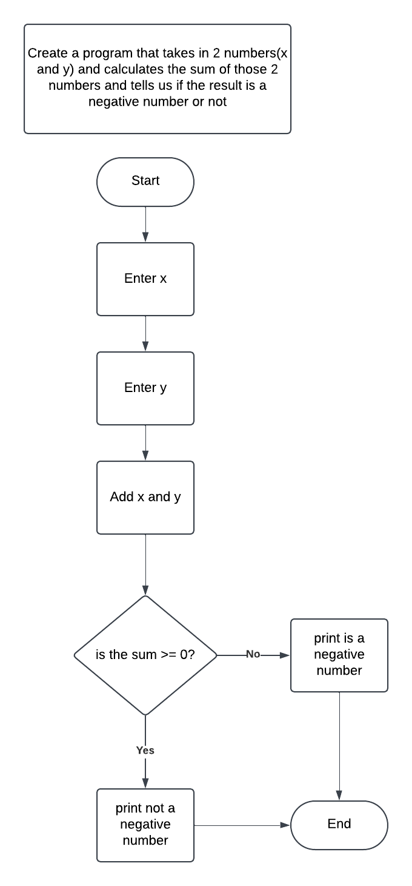

# Intro to Programming

- What is Programming?
- How does a program work?
- Programming language vs Natural Language
- Compiled vs Interpreted Languages
- Flowcharts
- Python Intro
- VS Code setup for Python
- Hello World! - Python

## What is Programming?

- Technical process of telling a computer which tasks to perform and what order to perform them in.
- Collaboration betweens humans and computers, where humans create instructions for a computer to follow (code) in a language the computers can understand. 
- There are many programming languages

## How does a program work?

- Programs are executed in sequence (top to bottom)
- These instructions are translated into binary (1's and 0's)  which is the language machines understand.

### Compiled vs Interpreted

- Translating code from something humans can read into machine language depends of 2 types of programming languages:

    1. Compiled languages: 
        - translate the code into machine language
        - often produce an executable file
        - for example C and C++

    2. Interpreted languages:
        - Execute the code directly without a compiler
        - for example Python and JavaScript

## Flowcharts

- a graphical representation of the steps to be taken when executing a program
- The steps are shown in sequential order and are widely used to represent the flow of algorithms.

- The rectangles usually represent process steps
- The diamonds indicates decisions or branches in the process
- The circles indicate connectors - a jump from one part of the process to another
- the ovals (terminators) indicate the process boundaries (start and stop)
- The connector arrows (flow lines) indicate the direction of the process flow.

Benefits of a flowchart:

- helps to clarify complex processes
- Serves as a basis for designing new processes
- Helps to gain a shared understanding of the process
- Makes it easier to identify steps that do not add value to the process

- https://lucid.app/