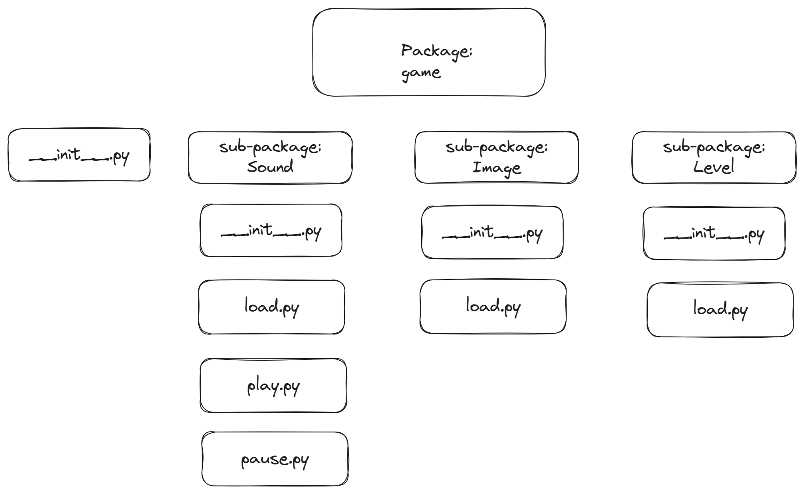
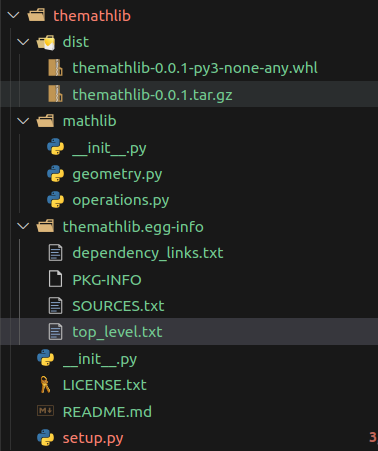

# Libraries

## 07.05.25 - Scripting, modules and packages

- What is a script?
- How to build a Python script
- Python driver code
- What is a module?
- Using the `import` statement
- What is a package?
- Package structure

### What is a script?

- Scripting refers to writing small programs to automate tasks, manipulate data or control other programs.
- A script is a file containing a sequence of instructions that will be executed to complete a specific task.
- Scripts usually have 3 benefits: automation, simplicity and flexibility.

### Building a Python Script

- A Python script consists of 4 main sections:

1. Shebang line:

    - You can add a shebang at the top of your script on Unix-based systems like macOS or Linux.
    - The shebang tells the system which interpreter to use when running a script.
    - There are at least 2 different ways to define the interpreter path

        1. Provide the absolute path to the interpreter:

            ```python
            #!/usr/bin/python3
            ```

            - This approach is less portable because not all Unix systems place the Python Interpreter in the same directory.

        2. Using the operating systems `env` command to point to the interpreter:

            ```python
            #!usr/bin/env python3
            ```

            - This approach is much safer and more portable. It invokes the `env` command to find out where the interpreter lives.

2. Module imports:

    - Python allows us to import pre-written code(called modules) to extend the functionality of our script.
    - These can be Python built-in modules or external libraries you have installed

        1. Importing the full module:

            ```python
            import datetime
            ```

        2. Import specific functions from a module:

            ```python
            from datetime import date
            ```

3. Functions definitions/general logic:

    - In this section we organize our code into functions and write the general logic for our script

        ```python
        def greet(name: str) -> str:
            return f"Hello, {name}"
        ```

4. Driver code/main program block:

    - It's common to include a special `if __name__ == "__main__":` block to run our script when executed directly, not when imported as a module into another script.

        ```python
        if __name__ == "__main__":
            print("This script is running directly")
        ```

    - If the code is always meant to be run as a script then this block is not necessary.

### Modules

- A module is a file that contains code to perform a specific task. It may contain variables, functions, classes, etc.
- Instead of putting everything in a single file, we can use modules to separate code into separate files as per its functionality.
- Making our code organized and easier to maintain.

**Example:**

```python
#!usr/bin/env python3
import math


def circle_area(radius):
    return math.pi * radius**2


def rectangle_area(width, height):
    return width * height
```

### The `import` statement

- We can import definitions inside a module into another module
- To do this we use the `import` keyword in Python

1. Implicit import

    - This does not import the names of the functions defined in a module
    - It only imports the module name

    ```python
    import datetime
    ```

    **Usage:**

    ```python
    curr_date = datetime.datetime.now()
    ```

2. Explicit import

    - We can import specific names from a modules without import the module as a whole
    - To do this we use the `from...import` statement
    - You can import as many names as possible form a module by separating each name using a comma(`,`)

    ```python
    from datetime import date, time
    ```

    **Usage:**

    ```python
    my_date = date(2026, 9, 14)
    ```

3. Import all

    - We can import all names from a module
    - This is done using an asterisk(`*`) to represent all names
    - We use the `from...import` statement
    - This allows us to call the names directly as if they were imported explicitly

    ```python
    from datetime import *
    ```

    **Usage:**

    ```python
    my_time = time(11, 45, 35)
    ```

    - This is not a good programming practice
    - This can lead to duplicate definitions for an identifier. 
    - It also hampers the readability of our code

4. Import with rename

    - We can also import a module and give it an alias or rename it
    - We use the `import...as` statement

    ```python
    import datetime as dt
    ```

    **Usage:**

    ```python
    curr_date = dt.datetime.today()
    ```

### Packages

- A package is a container with various functions, variables, names, modules, etc to perform specific tasks.
- We can separate code from a large program by putting into different files but under the same package.
- In order for python to recognize your code as as package you should include a `__init__.py` in the folder.
- The initialization file can be kept empty but generally any code that needs to be initialized for that package can be placed in that file.

**Example of a package structure:**



#### Importing module from a package

- We can use dot notation to import modules from packages

- to import the start module:

    ```python
    import game.level.start
    ```

    **Usage:**

    ```python
    game.level.start.select_difficulty(10)
    ```

    - import without a prefix

        ```python
        from game.level import start
        ```

        **Usage:**

        ```python
        start.select_difficulty(10)
        ```

## 08.05.25 - `pip`, PyPI(Python Package Index) and distributing packages

- What is `pip`?
- `pip` commands
- What is PyPI?
- Using PyPI
- Building a package for distribution

### What is `pip`?

- Is a package manager (a.k.a a package management system)
- It allows the installing, upgrading, configuring, removing, tracking, etc of packages in a consistent manner
- They also ensure integrity and authenticity of packages by tapping into trusted sources when managing packages

#### `pip` vs `pip2` vs `pip3`

- These commands correspond to the specific Python environment
- `pip2` works with Python 2.*
- `pip3` works with Python 3.*
- The base `pip` command works across all versions of Python, the numbered versions allow you to make sure that pip works in your respective environment.

#### Using `pip`

1. Installing packages

    1. Install the latest package(default)

        ```shell
        # pip install <package-name>
        pip install Django
        ```

    2. Install a specific package version

        ```shell
        # pip install <package-name>==<package-version-number>
        pip install pandas==1.4.0
        ```

    3. Install packages from a file

        ```shell
        pip install -r requirements.txt
        ```

2. Upgrading packages

    1. Upgrade a single package

        ```shell
        # pip install --upgrade <package-name>
        pip install --upgrade pandas
        ```

    2. Upgrade all packages from a file

        ```shell
        pip install -r requirements.txt --upgrade
        ```

3. Removing packages

    ```shell
    # pip uninstall <package-name>
    pip uninstall pandas
    ```

4. Track installed packages

    1. Display all installed packages as a table

        ```shell
        pip list
        ```

    2. Display all installed packages as a list

        ```shell
        pip freeze
        ```

    3. Store all installed packages in a file

        ```shell
        pip freeze > requirements.txt
        ```

        - Everytime you run this command it overwrites the contents of the file
        - This is very important for sharing with other developers what packages and dependencies they would need to run the program

5. Get help

    ```shell
    pip help
    ```

6. Get a summary of a package

    ```shell
    # pip show <package-name>
    pip show scikit-learn
    ```

### What is PyPI?

- The Python Package Index(PyPI) is the official 3rd-party package repository for the Python programming language. 
- It is the central repository that hosts and distributes software packages for Python developers to use
- developers can easily upload packages for others to use
- It is maintained by the Python Software Foundation

> Check out PyPI at: [https://pypi.org/](https://pypi.org/)

### Building a package for distribution

#### Common components of a package

1. Package directory: All package modules including the `__init__.py` file

2. `__init__.py`: A special file that is executed when the package is imported. It can contain code to initialize the package as well as definitions for variables, functions and classes.

3. Modules: Python files containing code that can be executed or imported by other modules. A package can contain more than one module

4. Subpackages: A package can contain more than one subpackage

5. Setup file: defines metadata about the package, such as name, version, author and dependencies. This file is used by package manager like pip to install the package and its dependencies

6. README file: Provides information about the package, such as its purpose, installation instructions and usage examples

7. License file: Specifies the terms under which the package can be used

#### Building a package from scratch

1. Create a project directory:

    ```shell
    mkdir themathlib
    cd themathlib
    ```

2. Create the root initializer file:

    ```shell
    touch __init__.py
    ```

3. Create the package directory:

    ```shell
    mkdir mathlib
    cd mathlib
    ```

4. Create the package initializer file:

    ```shell
    touch __init__.py
    ```

5. Create module files inside the package directory:

    1. `geometry.py`

        ```python
        import math


        def circle_area(radius):
            return math.pi * radius**2


        def circle_circumference(radius):
            return 2 * math.pi * radius
        ```

    2. `operations.py`

        ```python
        def add(x, y):
            return x + y


        def subtract(x, y):
            return x - y


        def multiply(x, y):
            return x * y


        def divide(x, y):
            return x / y
        ```

6. Create `setup.py` file in the project(root) directory:

    ```python
    from setuptools import setup, find_packages


    setup(
        name="<package-name>",
        author="<Your Name>",
        author_email="<Your Email>",
        version="0.0.1",
        description="<Short description of your package>",
        packages=find_packages(),
        classifiers=[
            "Programming Language :: Python :: 3",
            "License :: OSI Approved :: MIT License",
            "Operating System :: OS Independent",
        ],
        python_requires=">=3.6"
    )
    ```

7. Create README.md in the project directory:

    ```markdown
    # The Math Lib

    - This is a basic package with simple geometric operations and basic math operations
    ```

8. Add a license for our package:

    ```txt
    MIT License

    Copyright (c) [year] [fullname]

    Permission is hereby granted, free of charge, to any person obtaining a copy of this software and associated documentation files (the "Software"), to deal in the Software without restriction, including without limitation the rights to use, copy, modify, merge, publish, distribute, sublicense, and/or sell
    copies of the Software, and to permit persons to whom the Software is furnished to do so, subject to the following conditions:

    The above copyright notice and this permission notice shall be included in all copies or substantial portions of the Software.

    THE SOFTWARE IS PROVIDED "AS IS", WITHOUT WARRANTY OF ANY KIND, EXPRESS OR IMPLIED, INCLUDING BUT NOT LIMITED TO THE WARRANTIES OF MERCHANTABILITY, FITNESS FOR A PARTICULAR PURPOSE AND NONINFRINGEMENT. IN NO EVENT SHALL THE AUTHORS OR COPYRIGHT HOLDERS BE LIABLE FOR ANY CLAIM, DAMAGES OR OTHER LIABILITY, WHETHER IN AN ACTION OF CONTRACT, TORT OR OTHERWISE, ARISING FROM, OUT OF OR IN CONNECTION WITH THE SOFTWARE OR THE USE OR OTHER DEALINGS IN THE SOFTWARE.
    ```

9. Generate distribution archives:

    - The build should be generated from the project(root) directory

    ```shell
    python3 -m pip install --upgrade build
    python3 -m build
    ```

    - Your folder structure should now look something like this:

        


##### Uploading to PyPI

1. Go to [PyPI](pypi.org) and create an account

2. Run twine upload dist/* in the terminal for the project(root) directory

3. Enter the credentials of the account you just registered with

4. Then you can install your package

## 14.05.25 - parsing arguments from the command line

- What are command line arguments?
- `sys.argv` module
- Handling arguments in a script

### What are command line arguments?

- Allow users to pass information to a Python script.
- Could be anything from file names and configurations to flags that alter the script's behaviour.
- Makes scripts flexible and reusable, enabling the automation of various tasks

There are 3 main ways to handle command line arguments:

1. `sys.argv` - A simple way to handle command line arguments as a list of strings.
2. `getopt` - a built-in module for parsing command line options and arguments in a structured way.
3. `argparse` - An advanced and flexible module that provides built-validation, help messages and better argument handling.

#### `sys.argv`

- `sys.argv` is a list that stores command line arguments passed to a Python script.
- The first element (`sys.argv[0]`) always represents the script name
- The remaining elements are the actual arguments provided to the script.
- These arguments are always treated as strings, so they may need to be converted to the appropriate data type
- The `.argv` list is part of the built-in `sys` module

**Example:**

```python
""" 
Script to calculate the numbers provided by the user from the 
command line.
Usage: `python3 calc_1.py <operation> <num1> <num2>`
"""
import sys

arguments = sys.argv  # List of arguments


num1 = int(arguments[2])
num2 = int(arguments[3])

# Check for the operation
if arguments[1] == "-multiply" or arguments[1] == "-m":
    print(num1 * num2)
elif arguments[1] == "-add":
    print(num1 + num2)
elif arguments[1] == "-subtract":
    print(num1 - num2)
elif arguments[1] == "-divide":
    print(num1 / num2)
```

#### using `argparse`

**Syntax:**

```python
import argparse
```

1. Creating the parser object

    ```python
    parser = argparse.ArgumentParser(description="Short description")
    ```

    - The description text will be using the `--help` flag

2. Creating a positional argument:

    ```python
    parser.add_argument("<name-of-arg>", help="Descriptionof positional argument")
    ```

    - A positional argument must be provided when running the script
    - `help` will be shown in `--help`

3. Creating an optional argument

    ```python
    parser.add_argument("-o", "--optional", help="Description of the optional argument")
    ```

4. Parse the command line arguments:

    ```python
    args = parser.parse_args()
    args.optional
    ```

    - Will a namespace with the arguments as attributes
    - The attributes can called using the verbose flag name

    


