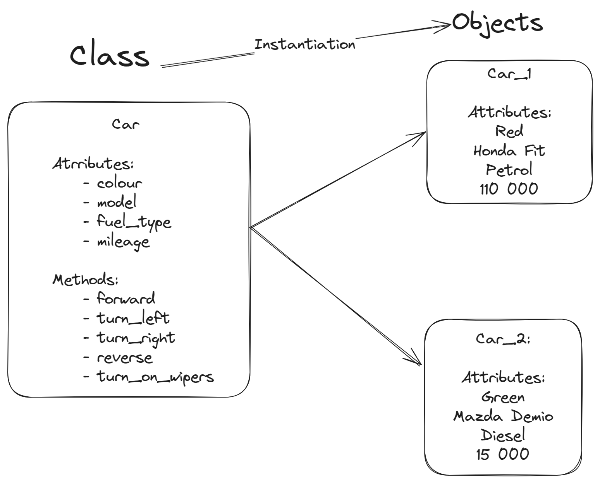

# Object Oriented Programming - OOP

## 13.03.25 - OOP Introduction

- What is OOP?
- How to create Classes?
- Class vs object/instance
- Instantiating objects - Creating objects - creating instances
- The `self` keyword
- Attributes/properties in a class
- Methods in a class
- Passing arguments to methods

### What is OOP?

- Is based on the programming paradigm that uses statements to change a programs state. Mainly focusing on how the program should operate
- OOP uses concepts of objects and classes. 
- A class can be thought of as a blueprint for creating objects.
- Objects can have their own attributes/properties(characteristics they possess) and methods ( actions they can perform)
- OOP allows a modular design pattern for programs, allowing us to separate different of objects and the functionalities while still allowing for reusability.

### Classes vs Objects/Instances

- A class can be used to create as many objects as possible
- An object is always going to be independent of other objects



### Creating Classes

- To define a Python class we use the keyword `class` followed by the class name and a colon(`:`)
- The class name must always be capitalized
- Inside this class an `__init__` method is supposed to be defined. This is the initializer/constructor that will be used to instantiate objects.
- `__init__` must always be present, it takes 1 argument which the `self` keyword.

```python
# Define a class called Car
class Car:
    """
    A car class for our example
    """

    def __init__(self):
        pass
```

### Instantiating Objects/Creating Objects

- To instantiate an object, type the class name, followed by parentheses.
- You can assign this to a variable in order to keep track of it.

```python
# Instantiate a Mazda

mazda = Car()
print(mazda)

# Instantiate a Audi
audi = Car()
print(audi)
```

### Challenge 1

1. Create a class called Employee and instantiate 2 objects from this class

    ```python
    class Employee:

        def __init__(self):
            pass

    greg = Employee()
    janice = Employee()
    ```

2. Create a class called Animal and instantiate 2 objects from this class

    ```python
    class Animal:

        def __init__(self):
            pass

    parrot = Animal()
    elephant = Animal()
    ```

### The `self` keyword

- Is used to represent an instance(object) of a class.
- It becomes very important when referring to attributes and methods within the class
- It allows the separation of instances and their attributes and methods

### Defining Attributes

**Instance Attributes**

- Attributes/Properties are what defined the object(characteristics)
- These are usually defined in the `__init__` method.

```python
# Define a class called Car
class Car:
    """
    A car class for our example
    """

    def __init__(self, colour, model, fuel_type, mileage: int):
        # Instance attributes
        self.colour = colour
        self.model = model
        self.fuel_type = fuel_type
        self.mileage = mileage
        self.num_of_owners = 1
    

# Instantiate a Mazda
mazda = Car("Green", "Demio", "Petrol", 15000)
print(mazda)

# Instantiate an Audi
audi = Car(colour="Red", model="A4", fuel_type="Petrol", mileage=75000)
print(audi)
```

**Accessing attributes:**

- To access an attribute we use dot notattion.
- This is done by typing the name of the object, followed by a dot and the attribute's name
    
    ```python
    # Instantiate a Mazda
    mazda = Car("Green", "Demio", "Petrol", 15000)
    print(mazda)

    # Accessing the attributes
    print(mazda.colour)
    print(mazda.model)
    ```

**Class Attributes**

- These are universal attributes that cover all instantiated objects.
- They serve as a common attribute that can cut across all objects created from the class
- They sometimes serve as defaults
- Class attributes are defined outside of the `__init__` method and just after the class declaration
- There is no need to use the `self` keyword
- In order to change a class attribute you would need to access through the class itself and not an instantiated object.

```python
# Define a class called Car
class Car:
    """
    A car class for our example
    """
    
    # Class attributes
    num_of_wheels = 4
    spare_tyres = 1

    def __init__(self, colour, model, fuel_type, mileage: int):
        # Instance attributes
        self.colour = colour
        self.model = model
        self.fuel_type = fuel_type
        self.mileage = mileage
        self.num_of_owners = 1

# Instantiate a Mazda
mazda = Car("Green", "Demio", "Petrol", 15000)
print(mazda.num_of_wheels) # Output: 4

# Changing the class attribute
Car.num_of_wheels = 6

# Instantiate an Audi
audi = Car(colour="Red", model="A4", fuel_type="Petrol", mileage=75000)
print(audi.num_of_wheels) # Output: 6
```

### Challenge 2 

1. Add 5 attributes of your choice to your Employee class and access at least 3 of them

    ```python
    class Employee:

        def __init__(self, first_name, last_name, age, employee_id, department):
            self.first_name = first_name
            self.last_name = last_name
            self.age = age
            self.employee_id = employee_id
            self.department = department
            

    greg = Employee("Greg", "Brown", 42, 13467, "Marketing")
    print(f"{greg.first_name} {greg.last_name} is part of the {greg.department} department.")
    ```

2. Add 5 attributes of your choice to your Animal class and access at least 3 of them elephant = Animal()

    ```python
    class Animal:

        def __init__(self, name, species, age, height, weight):
            self.name = name
            self.species = species
            self.age = age
            self.height = height
            self.weight = weight

    parrot = Animal(name="Peter", species="Grey parrot", age=3, height="10cm", weight="1.5kgs")

    print(f"{peter.name} the {peter.species} is {peter.age} years old.")
    ```

### Defining methods

- Methods are the functionalities of the class
- These help to change the state of objects or perform object tasks/actions
- They are basically functions defined under the class
- In order to define a method we use the `def` keyword, followed by the name of the method, followed by parentheses with the `self` keyword as the first parameter and then a colon (`:`)
- Any other methods will come after the initializer(or any dunder methods)


```python
# Define a class called Car
class Car:
    """
    A car class for our example
    """
    
    # Class attributes
    num_of_wheels = 4
    spare_tyres = 1

    def __init__(self, colour, model, fuel_type, mileage: int):
        # Instance attributes
        self.colour = colour
        self.model = model
        self.fuel_type = fuel_type
        self.mileage = mileage
        self.num_of_owners = 1
        
    # Defining methods
    def forward(self):
        print(f"We are moving forward in the {self.model}")
        
    def reverse(self):
        print("We are moving backwards")

# Using methods
audi.forward()
mazda.forward()
mazda.reverse()
```

### Passing arguments to methods

- When defining methods any parameters are supposed to be declared after the `self` keyword
- These parameters can still be declared and used just like regular function parameters

```python
# Define a class called Car
class Car:
    """
    A car class for our example
    """
    
    # Class attributes
    num_of_wheels = 4
    spare_tyres = 1

    def __init__(self, colour, model, fuel_type, mileage: int):
        # Instance attributes
        self.colour = colour
        self.model = model
        self.fuel_type = fuel_type
        self.mileage = mileage
        self.num_of_owners = 1
        
    # Defining methods
    def forward(self):
        print(f"We are moving forward in the {self.model}")
        
    def reverse(self):
        print("We are moving backwards")
        
    def refuel(self, num_of_litres: int):
        print(f"Please give me {num_of_litres} litres of {self.fuel_type}")

# Using methods
audi.forward()
mazda.reverse()
audi.refuel(35)
```

## 19.03.25 - OOP Principles and methods overriding in inheritance

- The pillars of OOP:
    1. Inheritance
    2. Encapsulation
    3. Polymorphism
    4. Abstraction
- Method overriding with inheritance
- How to override methods
- Tips on successful usage of OOP

### The pillars/principles of OOP

1. **Inheritance**

    - A way of creating a new class using details(code) from an existing class without modifying it.
    - The existing class is known as the parent(base) class
    - The newly class is known as the child(derived) class.
    - The child class can always be extended to have extra methods or attributes that may not be available in the parent class.
    - Any changes made on the parent will be effected on the child class. While changes made on the child class will just count as an extension on the child class.
    - Inheritance allows us to create objects that share code or logic yet are different.

    - In Python, we inherit by placing the name of the parent in parentheses after the name of the child class.

        ```python
        # Parent/Base class
        class Animal:
            
            def __init__(self, name):
                self.name = name
                
            def eat(self):
                print("I am eating.")
                
            def sleep(self):
                print("I am sleeping")
                

        # Child/Derived class
        class Dog(Animal):
                
            def bark(self):
                print("Woof woof!")
                
        # Create object from animal class
        animal1 = Animal("Frost")       
        animal1.eat()

        # Create an object from the dog class
        dog1 = Dog("Jack")
        dog1.sleep()
        dog1.bark()
        ```

    **Multiple Inheritance:**

    - A class can be derived from more than one class.
    - This is achieved by placing the names of the parent classes in parentheses separated by commas(`,`) after the name of the child class.
    - The order in which the classes are inherited is very important.
    - If the parent classes have a method with the same name a technique known as MRO (Method Resolution Order) is used to determine which method should be inherited.
    - MRO specifies that the leftmost parent class' method will be inherited.

        ```python
        # Parent/Base class
        class Animal:
            
            def __init__(self, name):
                self.name = name
                
            def eat(self):
                print("I am eating.")
                
            def sleep(self):
                print("I am sleeping")

        class Mammal:
            
            def give_birth(self):
                print("My child is fully-formed")
                
            def eat(self):
                print("I am eating as a mammal")
            
            
        class Cat(Mammal, Animal):
            pass


        garfield = Cat("Garfield")
        garfield.eat()
        garfield.sleep()
        garfield.give_birth()
        ```

    **Multi-level Inheritance**

    - This is achieved when you create a child class from another child class.

        ```python
        # Parent/Base class
        class Animal:
            
            def __init__(self, name):
                self.name = name
                
            def eat(self):
                print("I am eating.")
                
            def sleep(self):
                print("I am sleeping")
                

        # Child/Derived class
        class Dog(Animal):
                
            def bark(self):
                print("Woof woof!")
                
        class Puppy(Dog):
            pass

        puppy1 = Puppy("Sparkie")
        puppy1.eat()
        puppy1.sleep()
        puppy1.bark()
        ```


2. **Encapsulation**

    - Refers to the bundling of attributes and methods inside a single class.
    - It prevents outer classes from accessing and changing attributes and methods.
    - Also known as data hiding
    - Encapsulation seeks to hide the implementation details of objects from the outside. 
    - Itb states that all the important information is contained within the object - only selected data is available externally.
    - The inner workings are stored privately within the specified class
    - This provides security and control over object state changes, reduces risks of errors and makes the program more understandable.
    - In Python we denote private attributes/methods using underscore(`_`) as the prefix: i.e single `_` or double `__`

        ```python
        class Product:
    
            def __init__(self):
                self.__max_price = 1000
                self._discount = 0.1
            
            def sell(self):
                if self._discount:
                    price = self.__max_price - (self.__max_price * self._discount)
                    print(f"We are selling for {price}")
                    
                else:
                    print(f"We are selling for {self.__max_price}")
            
            # Setter methods
            def set_max_price(self, new_price):
                self.__max_price = new_price
                
            def set_discount(self, new_discount):
                self._discount = new_discount
                
                
        radio = Product()

        radio.sell()
        # Using the setter function
        radio.set_max_price(2000)
        radio.sell()
        ```

3. **Polymorphism**

    - Simply means more than one form.
    - The same entity(method, operator or object) can perform different operations in different scenarios.
    - It complements inheritance by allowing different classes to perform actions with the same name but using different code.
    - In order for Polymorphism to be achieved inheritance needs to be implemented.
    - This is sometimes also known a s method overriding

        ```python
        class Vehicle:
    
            def refuel(self, litres):
                print(f"Refuelling with {litres} litres of fuel")
                

        class Truck(Vehicle):
            
            def refuel(self, litres):
                print(f"Refuelling with {litres} of Diesel.")

            
        class Bicycle(Vehicle):
            
            def refuel(self):
                print("I do not need fuel")


        vehicle_1 = Vehicle()
        vehicle_1.refuel(30)

        volvo_truck = Truck()
        volvo_truck.refuel(40)
        ```

4. **Abstraction**

    - Abstraction can be thought of as an expansion of encapsulation.
    - Each object only reveals a specific mechanism for usage.
    - It hides complex implementation details while just showing users the most crucial data and functions
    - In Python we can achieve abstraction by using abstract base classes which can be created using the `abc` (abstract base class) module and the `@abstractmethod` of the `abc` module.


### Tips for successful usage of OOP

1. Aim for simplicity and efficiency when designing OOP code.
2. Adhere to SOLID principles to prevent problems and keep code flexible, maintainable and easy to modify.
3. Identify the classes needed and their relationships to ensure programs function efficiently.
4. Employ abstraction to simplify understanding
5. Abide by programming standards and conventions to ensure code quality and maintainability.