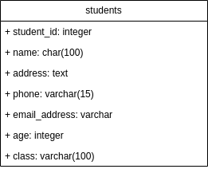
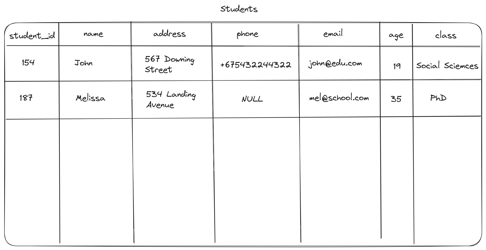
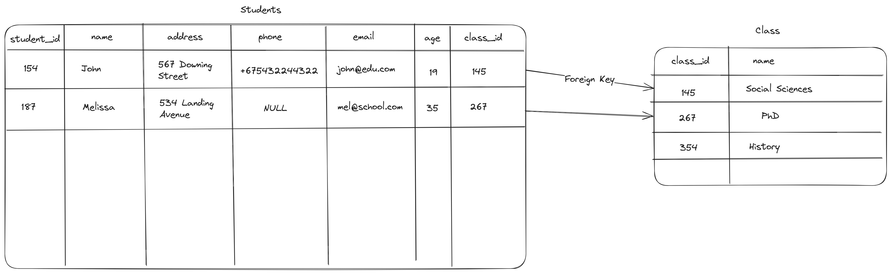

# Intro to Databases

## 15.05.25 - Basics

- What is a database?
- Database Management Systems (DBMS)
- Types of DBMS's
- DBMS vs RDBMS
- Characteristics of Relation Data and its structure

### What is a database?

- Is an organized collection of data.
- This collection can be easily accessed, updated and managed
- It is designed, built to be populated with data for a specific purpose
- The structure of a database consists of 2 main parts:

    1. Data - the actual information to be stored in the database
    2. Metadata - The structural description of data in the database. It describes the names of fields used to store data, the length of those fields(where applicable) and their data types. It gives structure and organization to raw data.

### Database Management System (DBMS)

- Is a program that enables users to create, maintain and control access to databases.
- The main goal is to provide a safe, convenient and efficient environment for users to retrieve and store information
- A DBMS can hold more than one databases
- The DBMS is what would be used to interact with the databases by other programs or by the code.
- It allows you to manipulate, maintain, report and relate data within
- Examples of DBMS's include:

    - MySQL
    - PostgreSQL
    - Oracle
    - Microsoft SQL Server
    - SQLite
    - Firebase
    - Redis
    - Mongo

### Types of DBMS's

1. Relational Databases

    - Most commonly used databases
    - Data is stored in tables(relations)
    - These tables have columns(fields) and rows(records)
    - Each row has a unique key or field used as an identifier
    - Most relational databases use SQL(Structured Query Language)

2. Non-relational / NoSQL 

    - These are databases that don't use a relational model
    - They are favoured for their quick read-write operations
    - They allow you store data in unstructured or semi-structured setups
    - Each record can have varying data points from the others
    - There are 4 different types of Non-relational databases:

        1. Key-Value:
            - These are the simplest NoSQL databases
            - Every record is stored as a pair consisting of an attribute/key and a value
            - The structure is similar to a relational database except there two columns: Key and Value
            - These are typically used to store information temporarily eg. shopping carts, caching, user preferences, etc.

        2. Document:
            - These store data in JSON(JavaScript Object Notation), BSON(Binary-encoded JSON) or XML(Extensible Markup Language)
            - They make it easier to access and use your documents across different applications
            - In traditional SQL, data must often be assembled and disassembled when moving from one application to the other
            - They are very popular because the document structures can be reworked very easily to suit whatever application they're using

        3. Graph
            - These focus on the relationship between different data elements.
            - Each element is a node and the connections between elements are links or relationships
            - They can store data in a structured document similar to JSON, in a key-value format or as nodes to represent objects and edges to describe the relationship between them
            - Typically used for social networks and fraud detection

        4. Column-oriented:
            - These are organized and read as a column as opposed reading row by row in relational databases.
            - Typically used for analytics as columns are of the same type
            - Makes it easier to read data faster and aggregate a given column

### Characteristics and structure of relational data

- Relational data is organized using 3 features:

    1. Tables(relations): Represent a specific entity, object or concept. A database can have as many tables as possible
    2. Rows(Records): Each row in a table represents a single record. Tables can have as many records as possible
    3. Columns(Fields/Attributes): Each column represent a data field or attribute associated with the entity/object. These fields also determine the data type of the attribute.

- In order to separate records each row has a unique identifier known as a Primary Key
- We can link one table to the other(creating relationships) through Foreign Keys.
- Relational databases need to have ACID properties:

    1. Atomicity:
        - This enforces that data should always be accurate.
        - Data should always be compliant with the rules, regulations and policies of the business.
        - It also requires that all tasks succeed, or the transaction will rollback

    2. Consistency:
        - The state of the database must remain consistent throughout a transaction.
        - Defines rules for maintaining data points to ensure that the database remains in a correct state after transaction.
        - If the database has copies those copies also need to have consistency within them

    3. Isolation:
        - Each transaction is separate and not dependent on others
        - It keeps the effect of a transaction invisible until it is committed.

    4. Durability:
        - You can recover data from a failed transaction
        - Ensures that data changes are permanent

## 16.05.25 - Relational Modeling and Installing PostgreSQL

- What is a relational model?
- Key Terms in Relational Models
- Examples of Models
- Primary Keys
- Foreign Keys
- Constraints
- Referential Integrity
- PostgreSQL basic install

### What is a relational model?

- Is an approach to logically represent and manage the data stored in a database
- The data is organized into a collection to tow-dimensional inter-related tables, also known as relations.
- Each relation is a collection of columns and rows, where the column represents the attributes of an entity and rows(tuples) represent the records.
- The use tables makes it straightforward, efficient and flexible to store and access structured information.

#### Key Terms in Relational Models

1. Attribute: Are the properties that define an entity.
    - Example: `employee_id`, `email_address`, `dept`, etc

2. Relation Schema: Sometimes known simply a Schema. Defines the structure of the relation and represents the name of the relation with its attributes.
    - Example: `student(student_id, name, address, phone, email, age, class)`

3. Tuple: Represents a row in a relation. Each tuple contains a set of attribute values that describe a particular entity.
    - Example: `(134, "Jason", "49 Waller Avenue", "+12334545232", "jason@school.com", 28, "CS50")`

4. Column: Represents a set of values for a particular attribute(field)
    - Example: When you extract the column `phone` from `student`

5. NULL values: This is a value which is not known or unavailable. It is represented by `NULL`
    - Example: The `age` field of a `student` having `student_id` 176 is `NULL`

6. Relation Instance: The set of tuples of a relation at a particular instance of time. It can change whenever there is an insertion, deletion or update to the database.

7. Degree: The number of attributes in the relation.
    - Example: Table `student` has a degree of 7.

8. Cardinality: The number of tuples in a relation.
    - Example: The `student` table has a cardinality of 35.

### Example Models

- Create a `student` table that has the following attributes/fields:
    1. `student_id`
    2. `name`
    3. `address`
    4. `phone`
    5. `email`
    6. `age`
    7. `class`

    

    

    ```sql
    CREATE DATABASE school;

    -- Connect to the database before creating tables

    CREATE TABLE students(
        student_id SERIAL PRIMARY KEY,
        full_name CHAR(100),
        address TEXT,
        phone VARCHAR(15),
        email_address VARCHAR,
        age INT,
        class VARCHAR(100)
        );
    ```

### Keys in Relational Models

1. Primary Key:
    - Identifies each tuple in a relation.
    - It must contain unique values
    - It must not be `NULL`
    - It is usually best to let the database handle generation of Primary Keys when you insert records
    - Example: `student_id` is the primary key in the `student` table.

2. Foreign Key:
    - an attribute in one relation that refers to the primary key of another relation
    - It establishes relationships between tables.
    - Example: `class_id` in the `students`table that link the class table

    

### Constraints in Relational Models

- Constraints are conditions that we define when creating the database.
- These conditions need to be upheld when interacting with the database
- They are checked before performing any CRUD(Create, Read, Update, Delete) operation 
- If any constraint is violated the operation will fail

1. Domain Constraints:

    - Ensures that the value of each attribute in a tuple must be an atomic value derived from its specific domain.
    - Domains are defined by the data types associated with attributes/fields
    - Common data types include:
        1. Numeric Types: 
            - Integers(short, regular, long) for whole numbers
            - Real numbers(float, double-precision) for decimal values

        2. Character types:
            - Fixed-length(CHAR)
            - Variable-length (VARCHAR, TEXT) used for storing text data of various sizes

        3. Boolean Values: 
            - Stores True or False
            - Often used for flags or conditional checks

        4. Specialized Types:
            - date(DATE)
            - time(TIME)
            - timestamp(TIMESTAMP)
            - money(MONEY)
            - used for precise handling of time-related and financial data

2. Key Integrity:

    - Every relation in the database should have at least one attribute that defines the tuple uniquely.
    - That attribute is called a key
    - Keys have 2 main constraints:
        1. It should unique for all tuples
        2. It can't have `NULL` values

3. Referential Integrity:

    - When one attribute/field can only take values from another attribute/field, either from the same table or from a different table
    - It dictates that there must be only one primary key value for a foreign key
    - Referential integrity is usually violated when:
        - Primary keys are not properly enforced
        - Foreign keys are not properly enforced
        - Database design is incorrect

    - To ensure referential integrity we must:
        - Create primary and foreign keys for each table
        - Ensure that the data types for the primary and foreign keys are matching
        - Ensure there are no duplicate entries
        - Make sure not to create circular relationships

### Installing PostgreSQL

1. Update the local package index:

    ```shell
    sudo apt update
    ```

2. Install the Postgres package along with the `-contrib` package that adds some extra utilities and functionality:

    ```shell
    sudo apt install postgresql postgresql-contrib
    ```

3. Ensure that the server is running using the `systemctl start` command:

    ```shell
    sudo systemctl start postgresql.service
    ```

4. Check the status of the server:

    ```shell
    sudo systemctl status postgresql.service
    ```

### Installing DBeaver

You can find the DBeaver download options at this link: [https://dbeaver.io/download/](https://dbeaver.io/download/)

- Install on Linux using the `snap` command:

    ```shell
    sudo snap install dbeaver-ce
    ```

#### Default Postgres Settings on DBeaver

Host: localhost
Port: 5432
Database: postgres
Username: postgres
Password: postgres or ""

> In case the password authentication fails login to the `psql` prompt and change the password. Use the new password to connect on DBeaver.

### Structured Query Language (SQL)

- This is a programming language for storing and processing information in a relational database.
- It is used for the common CRUD(Create, Read, Update, Delete) and also has some extra features to control the manipulation of data.
- SQL is broken up into 4 main categories:

1. DDL(Data Definition Language)
    - Commands that can be used for definign, altering and deleting database structures such as tables, indexes, schemas, etc.
    - It simply deals with the descriptions of the database schema and is used to create and modify the structure of a database

    | Command | Description | Syntax |
    |---------|-------------|--------|
    | `CREATE` | Create databases or its objects(table, functions, indexes, views, store procedures and triggers) | `CREATE TABLE <table_name>(column1 data_type, column2 data_type, ...);` |
    | `DROP` | Deletes objects from the database or the database itself | `DROP TABLE <table-name>;` |
    | `ALTER` | Change the structure of the database | `ALTER TABLE <table-name> ADD <column_name> <data-type>;` |
    | `TRUNCATE` | Remove all records from a table, including all spaces allocated for the records | `TRUNCATE TABLE <table_name>;` |

2. DQL (Data Querying Language)
    - Used for performing  queries on the data within schema objects.
    - It's purpose is to get some scherma relation based on the query passed to it.
    - When `SELECT` is run against a database table or tables the result is compiled into a further temporary table.

    | Command | Description | Syntax |
    |---------|-------------|--------|
    | `SELECT` | Is used to retrieve data from the database | `SELECT column1, column2, ... FROM table_name WHERE condition;` |

3. DML (Data Manipulation Language)
    - These commands deal with the manipulation of data present in the database. 
    - Tis group includes most of the SQL statements and can sometimes be grouped together with DCL.

    | Command | Description | Syntax |
    |---------|-------------|--------|
    | `INSERT` | Initially create/insert data into a table | `INSERT INTO <table-name>(column1, column2, ...) VALUES (value1, value2, ....), (value1, value2,...);` |
    | `UPDATE` | Update/edit existing data within a table | `UPDATE <table-name> SET column1 = value1, column2 = value2 WHERE condition;` |
    | `DELETE` | Deletes a record(s) from a database table | `DELETE FROM <table-name> WHERE condition;` |

4. DCL (Data Control Language)
    - Mainly deal with rights, permissions and privileges and other controls of the database system.
    - They control access to the database by granting or revoking permissions.

    | Command | Description | Syntax |
    |---------|-------------|--------|
    | `GRANT` | Assigns new privileges to a user account, allowing access to specific objects, databases, functions, or actions | `GRANT <privilege-type> [(column_list)] ON <object-type> <object-name> TO <username> [WITH GRANT OPTION];` | 
    | `REVOKE` | Removes previously granted privileges from a user account, taking away their access to certain database objects or actions | `REVOKE [GRANT OPTION FOR] <privilege-type> [(column_list)] ON [object-type] object-name FROM user [CASCADE];` |

## 21.05.25 - Using DDL, DML and DQL

- Creating a database
- Adding tables to the database
- Insert data into database tables
- Query data from database
- Update data in the database

**Scenario:**

- A supermarket has approached to design their database to store the products they sell and also keep track of inventory. The owner wants to know the names, prices and stock levels of all prices. You may include any other information that you may see as relevant to your database design.

**Important questions when designing a DB:**

1. What kind of information are you going to store?
2. What properties does this information have?
3. What type of data does each of these properties contain?

### Creating a database

```sql
CREATE DATABASE e07_store;
```

### Creating tables

1. Products table

    - id: primary key
    - name: varchar
    - brand: varchar
    - price: float
    - quantity: int
    - category: varchar

    ```sql
    -- Create products table
    CREATE TABLE products (
        product_id SERIAL PRIMARY KEY,
        product_name VARCHAR,
        brand VARCHAR,
        price FLOAT,
        quantity INT,
        category VARCHAR
    );
    ```

2. Suppliers table

    - id: primary key
    - name: varchar
    - address: varchar
    - phone: varchar
    - email: varchar
    - contact_person: varchar
    - product_name: varchar
    - active: bool 

    ```sql
    -- Create suppliers table
    CREATE TABLE suppliers (
        supplier_id SERIAL PRIMARY KEY,
        supplier_name VARCHAR,
        product_name VARCHAR,
        contact_name VARCHAR,
        contact_email VARCHAR,
        contact_phone VARCHAR,
        address VARCHAR,
        city VARCHAR,
        state VARCHAR,
        postal_code VARCHAR,
        country VARCHAR,
        is_active BOOL
    );
    ```

### Inserting data into tables

```sql
INSERT INTO <table-name>(<column1>, column2, ...)
VALUES (value1, value2, ...);

-- OR 

INSERT INTO <table-name>(*) 
VALUES (value1, value2, ...);
```

- VALUES is the keyword telling PostgreSQL about the data you wish to insert.
- After the VALUES keyword, specify a comma-separated list of tuples with the corresponding values for the columns mentioned.

```sql
-- Insert data into the Products table
INSERT INTO products(
	product_name, brand, price, quantity, category)
VALUES
	('MacBook Pro', 'Apple', 2500.00, 100, 'Laptops'),
	('Zenbook', 'Asus', 2000.00, 75, 'Laptops'),
	('Galaxy 25 Edge', 'Samsung', 1100.00, 200, 'Smartphones');

-- Insert 5 records into the suppliers table

INSERT INTO suppliers(supplier_name, product_name, contact_name, contact_email, contact_phone, address, city, state, postal_code, country, is_active)
VALUES
	('Microsoft', 'Windows', 'Bill Gates', 'bill@microsoft.com', '+1321654987', 'New York road 45', 'New York', 'Washington', '1234', 'America', TRUE),
	('Apple', 'Mac', 'Bob Jones', 'bob@apple.com', '+1123456789', 'Graphite road 2', 'Missisippi', 'State 17', '5432', 'America', TRUE),
	('Samsung', 'Galaxy', 'Won Fang', 'won@samsung.com', '+5395148624', 'Tontan road 7', 'Tokyo', 'JP1', 't8651', 'Japan', TRUE);
```

### Retrieving data from the database

- This is where DQL is used.
- In order to get information from the database we use the `SELECT` command.
- The results from the `SELECT` can be enhanced by using clauses within the command. For example `WHERE`, `ORDER BY`, `FILTER`, etc.

1. Select all data from the products table

    ```sql
    SELECT * FROM products;
    ```

2. Select the product_name and price from the products table

    ```sql
    SELECT product_name, price FROM products;
    ```

3. Select the supplier_name and contact_phone from the suppliers table

    ```sql
    SELECT supplier_name, contact_phone FROM suppliers;
    ```

4. Select all products where the price is greater than 2000

    ```sql
    SELECT * FROM products
    WHERE price > 2000;
    ```

### Updating data in the database

- In order to update/edit information in the database we use the `UPDATE` command paired with the `WHERE` clause
- The number of records updated in one go should e limited to the very specific that you would like to update.
- Just like the `DELETE` command the update has a lot of power over data.

1. Update the product_name to MacBook Air and the price to 2100 where the product_id = 1

    ```sql
    UPDATE products SET product_name = 'MacBook Air', price = 2100.00
    WHERE product_id = 1;
    ```

2. Update the country to Korea in the suppliers table where supplier_name = Samsung

    ```sql
    UPDATE suppliers SET country = 'Korea' 
    WHERE supplier_name = 'Samsung';
    ```

3. Update the quantity to 5 if the product_name = Galaxy 25 Edge

    ```sql
    UPDATE products SET quantity = 5 WHERE product_name = 'Galaxy 25 Edge';
    ```

## 22.05.25 - Logical operations and conditionals in DQL

- `WHERE` clause
- Common Logical operators
- Basic Usage of Logical operators
- Combining Logical operators
- Run an existing SQL script from `psql`

### `WHERE` clause

- The `WHERE` clause is used to narrow down records using conditional statements
- It uses regular logical operators to compare conditions.
- It is mainly used with DQL and DML, specifically `SELECT`, `UPDATE`, `DELETE`
- It uses the condition filter rows returned from the command
- Evaluates to either True or False
- The query will return only the rows that make the condition evaluate to true in a result set.

**Common Logical Operators:**

| Operator | Description |
|----------|-------------|
| `ALL` | True if all of a set of comparisons are True |
| `AND` | True if all conditions separated by AND are True | 
| `ANY` | True if any of the set of comparisons is are True |
| `BETWEEN` | True if the operand lies within the range of comparisons | 
| `EXISTS` | True if a subquery returns one or more records |
| `IN` | True if the operand is equal to one of a list of expressions |
| `LIKE` |  True if the operand matches a pattern |
| `NOT` | Reverses the value of any other Boolean operator |
| `OR` | True if any of the conditions separated OR is True |
| `IS NULL` | True if the expression value is `NULL` |

#### `AND` operator

- The SQL ANd operator is used to combine multiple conditions in a `WHERE` clause.
- Allowing you to retrieve rows meeting all specified conditions

**Usage:**

```sql
SELECT * FROM <table-name>
WHERE <condition-1> AND <condition-2>;

-- Select all employees whose age is less than 25 and salary is greater than 2000
SELECT * FROM employees WHERE age < 25 AND salary > 2000;
```

#### `BETWEEN` operator

- This operator is used to filter data within a specified range of values
- The range of values should be of the same data type
- Usually reserved for dates and numbers
- Is inclusive of the upper bound/limit

**Usage:**

```sql
SELECT * FROM <table-name>
WHERE <field/attribute> BETWEEN <lower-limit> AND <upper-limit>;

-- Select all employees between the ages of 25 and 35
SELECT * FROM employees 
WHERE age BETWEEN 25 AND 35;

-- Select name and age from employees with salaries ranging from 2000 to 8500
SELECT name, age FROM employees 
WHERE salary BETWEEN 2000 AND 8500;
```

#### `EXISTS` operator

- This is used to verify whether a particular record exists in an SQL table
- While using this operator we need to specify the record (which we want to check for existence) as a subquery.
- It is used in the `WHERE` clause to filter results based on the existence of rows in the subquery
- The `EXISTS` operator returns True if subquery returns at least one row, otherwise, False.

**Usage:**

```sql
SELECT * FROM <table-name>
WHERE EXISTS (<subquery>);

-- Select name, address and salary from employees where the age is 25
SELECT name, address, salary 
FROM employees 
WHERE EXISTS (SELECT * FROM employees WHERE age BETWEEN 25 AND 35);
```

## 23.05.25 - Postgresql Data Types and Relationships

- Data Types in Postgresql:
    1. Numeric Data Types
    2. Character Data Types
    3. Time-related Data Types
    4. Boolean Data Types
    5. Array Data Types
    6. Composite Data Types
    7. Special Data Types
- Creating Relationships through Foreign Keys

### Data Types in Postgresql

- PostgreSQL has all the standard RBDMS data types, and then some.
- While creating tables, for each column, you specify a data type, i.e., what kind of data you want to store in the table fields.
- This enables several benefits:

    - *Consistency* − Operations against columns of same data type give consistent results and are usually the fastest.
    - *Validation* − Proper use of data types implies format validation of data and rejection of data outside the scope of data type.
    - *Compactness* − As a column can store a single type of value, it is stored in a compact way.
    - *Performance* − Proper use of data types gives the most efficient storage of data. The values stored can be processed quickly, which enhances the performance.

- PostgreSQL supports a wide set of Data Types.
- Users can create their own custom data type using `CREATE TYPE` SQL command
- There are different categories of data types in PostgreSQL:

    1. Numeric Data Types

        1. **Integer data types**:

            - The most commonly used integer types are:
                1. `SMALLINT`: This is a 2-byte signed integer, with a range of -32768 to +32767.
                2. `INTEGER`: This is a 4-byte signed integer, with a range of -2147483648 to +2147483647.
                3. `BIGINT`: This is an 8-byte signed integer, with a range of -9223372036854775808 to +9223372036854775807.

                **Example:**

                ```sql
                CREATE TABLE employees (
                    id INTEGER PRIMARY KEY,
                    name TEXT,
                    age INTEGER,
                    salary NUMERIC(10, 2)
                );
                ```

        2. **Floating-point data types**:

            - PostgreSQL provides two floating-point data types:
                1. `FLOAT` is a 4-byte floating-point number.
                2. `DOUBLE PRECISION` is an 8-byte floating-point number.

                **Example:**

                ```sql
                CREATE TABLE products (
                    id SERIAL PRIMARY KEY,
                    name TEXT,
                    price DOUBLE PRECISION
                );
                ```

        3. **Decimal data types**:

            - There are two decimal data types: 
                1. `NUMERIC`
                2. `DECIMAL` 
            - These types are used to store numbers with a fixed number of digits before and after the decimal point.
            - The difference between the two types is that `DECIMAL` is an alias for `NUMERIC`, but with different default precision and scale values.

                **Example:**

                ```sql
                CREATE TABLE orders (
                    id SERIAL PRIMARY KEY,
                    customer TEXT,
                    amount NUMERIC(10, 2)
                );
                ```

        4. **Serial data types**:

            - Serial is a shorthand notation for creating an auto-incrementing integer column. 
            - When you create a column with the `SERIAL` data type, PostgreSQL will automatically create a sequence object to generate the next value for the column.

                **Example:**

                ```sql
                CREATE TABLE users (
                    id SERIAL PRIMARY KEY,
                    username TEXT,
                    password TEXT
                );
                ```

    2. Character Data Types

        1. **`CHAR` data type**:

            - The char data type stores fixed-length character strings. 
            - When defining a column with the char data type, you must specify the length of the string.

                **Example:**

                ```sql
                CREATE TABLE employees (
                    employee_id serial PRIMARY KEY,
                    last_name char(20),
                    first_name varchar(20),
                    hire_date date
                );
                ```

        2. **`VARCHAR` data type**:

            - The varchar data type stores variable-length character strings. 
            - When defining a column with the varchar data type, you must specify the maximum length of the string. 

                **Example:**

                ```sql
                CREATE TABLE customers (
                    customer_id serial PRIMARY KEY,
                    first_name varchar(20),
                    last_name varchar(20),
                    email varchar(50),
                    phone varchar(15)
                );
                ```

        3. **`TEXT` data type**:

            - The text data type stores long strings of text with no specified length limit.

                **Example:**

                ```sql
                CREATE TABLE products (
                    product_id serial PRIMARY KEY,
                    product_name varchar(50),
                    description text,
                    price decimal(8,2)
                );
                ```

    3. Time-related Data Types

        1. **`DATE` data type**:
            - The date data type is used to store dates in the format of `YYYY-MM-DD`. 

                **Example:**

                ```sql
                CREATE TABLE orders (
                    order_id serial PRIMARY KEY,
                    order_date date,
                    customer_id int,
                    product_id int,
                    quantity int,
                    total decimal(8,2)
                );
                ```

        2. **`TIME` data type**:
            - The time data type stores the time of day in the format of `HH:MI:SS`.

                **Example:**

                ```sql
                CREATE TABLE visitors (
                    visitor_id serial PRIMARY KEY,
                    first_name varchar(20),
                    last_name varchar(20),
                    checkin_time time,
                    checkout_time time
                );
                ```

        3. **`TIMESTAMP` data type**:
            - The timestamp data type stores both date and time information in the format of `YYYY-MM-DD HH:MI:SS`.

                **Example:**

                ```sql
                CREATE TABLE comments (
                    comment_id serial PRIMARY KEY,
                    post_id int,
                    user_id int,
                    comment_text text,
                    created_at timestamp
                );
                ```

        4. **`INTERVAL` data type**:
            - The interval data type stores a period of time in a range of formats such as years, months, days, hours, minutes, and seconds.

                **Example:**

                ```sql
                CREATE TABLE tasks (
                    task_id serial PRIMARY KEY,
                    task_name varchar(50),
                    start_time timestamp,
                    end_time timestamp,
                    duration interval
                );
                ```

    4. Boolean Data Types
        - This is a simple data type that has only two possible values: `TRUE` or `FALSE`. 
        - It is useful in many situations where only two states are required, such as to represent the state of a flag or the result of a logical operation.

            **Example:**

            ```sql
            CREATE TABLE orders (
                order_id SERIAL PRIMARY KEY,
                customer_name VARCHAR(50) NOT NULL,
                order_date DATE NOT NULL,
                shipped BOOLEAN DEFAULT FALSE
            );
            ```
        
    5. Array Data Types
        - The data type array allows you to store multiple values of the same data type in a single column. 
        - This can be useful in situations where you need to store a list of values, such as a list of phone numbers or email addresses.

            **Example:**

            ```sql
            CREATE TABLE users (
                user_id SERIAL PRIMARY KEY,
                name VARCHAR(50) NOT NULL,
                emails TEXT[] NOT NULL
            );
            ```

            - In this example, the “emails” column is of type `TEXT[]` (an array of text values).

    6. Composite Data Types
        - With composite data types, you can define your own data types by combining multiple data types into a single data type. 
        - This is useful when you need to store multiple related values in a single column.

            **Example:**

            ```sql
            -- Creating a composite data type called address
            CREATE TYPE address AS (
                street VARCHAR(50),
                city VARCHAR(50),
                state CHAR(2),
                zip VARCHAR(10)
            );

            -- Using the address data type
            CREATE TABLE customers (
                customer_id SERIAL PRIMARY KEY,
                name VARCHAR(50) NOT NULL,
                address address
            );
            ```

            - In this example, we have defined a new data type called “address” that consists of four fields: street, city, state, and zip.

    7. Special Data Types

        1. **`UUID` data type**:
            - The `UUID` (Universally Unique Identifier) data type allows you to store unique identifiers as 128-bit values. 
            - This can be useful when you need to generate unique identifiers for records in a table.

                **Example:**

                ```sql
                CREATE TABLE users (
                    user_id UUID PRIMARY KEY DEFAULT uuid_generate_v4(),
                    name VARCHAR(50) NOT NULL
                );
                ```

                - The “user_id” column is of type UUID and has a default value of `uuid_generate_v4()`, which generates a new UUID value for each new record.

        2. **`JSON` data type**:
            - The `JSON` data type allows you to store `JSON` (JavaScript Object Notation) data in a column. 
            - This can be useful when you need to store complex data structures that can be easily serialized and deserialized.

                **Example:**

                ```sql
                CREATE TABLE products (
                    product_id SERIAL PRIMARY KEY,
                    name VARCHAR(50) NOT NULL,
                    attributes JSON NOT NULL
                );
                ```

        3. **`XML` data type**:
            - The XML data type allows you to store XML (Extensible Markup Language) data in a column. 
            - This can be useful when you need to store and query XML data in your database.

                **Example:**

                ```sql
                CREATE TABLE books (
                    book_id SERIAL PRIMARY KEY,
                    title VARCHAR(50) NOT NULL,
                    content XML NOT NULL
                );
                ```

        4. **`Hstore` data type**:
            - The Hstore data type allows you to store key-value pairs in a single column. 
            - This can be useful when you need to store a variable number of attributes for a record.

            **Example:**

            ```sql
            CREATE TABLE products (
                product_id SERIAL PRIMARY KEY,
                name VARCHAR(50) NOT NULL,
                attributes HSTORE NOT NULL
            );
            ```

### Creating Relationships through Foreign Keys

- A Foreign Key is a column or groups of columns that uniquely identify a record in another table.
- It establishes a link between the data in 2 tables by referencing the primary key or a unique constraint of the referenced table.
- The table containing the foreign key is referred to as the referencing table or child table.
- The table referenced by a foreign key is referred to as the referenced table or parent table
- The main purpose of a foreign key is to maintain referential integrity.
- Foreign keys maintain consistency by automatically updating or deleting related rows in the child table when changes occur in the parent table.
- A table can have multiple foreign keys depending on the relationships with other tables.

**Syntax:**

```sql
[CONSTRAINT <fk-name>]
    FOREIGN KEY(fk-column(s))
    REFERENCES <parent-table>(<parent-key-column>)
    [ON DELETE <delete-action>]
    [ON UPDATE <update-action>]
```

- Specify the name for the foreign key constraint after the `CONSTRAINT` keyword. This clause is optional. If you omit it PostgreSQL will assign an auto-generated name.
- Specify one or more foreign key columns in parentheses after the `FOREIGN KEY` keywords
- Specify the parent table and the parent key columns referenced by the foreign key columns in the `REFERENCES` clause
- Specify the desired delete or update actions in `ON DELETE` and `ON UPDATE` clauses.

- Actions available for `ON DELETE`:

    1. `SET NULL`
    2. `SET DEFAULT`
    3. `RESTRICT`
    4. `NO ACTION`
    5. `CASCADE`

**Scenario:**

- The store owner has contacted you and asked that you add a way to keep records of a suppliers contact person and their information. Implement a design that maintains referential integrity but still achieves the desired goal.

```sql
-- Drop existing tables
DROP TABLE IF EXISTS suppliers;
DROP TABLE IF EXISTS contacts;

-- Create suppliers table
CREATE TABLE suppliers(
	id SERIAL PRIMARY KEY,
	supplier_name VARCHAR(100) NOT NULL UNIQUE,
	brand_name VARCHAR(100),
	address TEXT,
	is_active BOOL
);

-- Create the contacts table
CREATE TABLE contacts(
	id SERIAL PRIMARY KEY,
	supplier_id INT,
	contact_name VARCHAR(255) NOT NULL,
	phone VARCHAR(15),
	email VARCHAR(100),
	-- Create the foreign key constraint
	CONSTRAINT fk_supplier
		FOREIGN KEY(supplier_id) -- refers TO COLUMN inside contacts table
		REFERENCES suppliers(id)
		ON DELETE SET NULL
		ON UPDATE NO ACTION
);

-- Create supplier records
INSERT INTO suppliers(supplier_name, brand_name, address, is_active)
VALUES ('Apple', 'Apple', 'One Apple Park Way, Cupertino, California', TRUE),
	('Microsoft', 'Microsoft', '1 Microsoft Way, Redmond, WA 98052, US', True),
	('Asus', 'Asus', '15, LiDe Rd., Beitou Dist, Taiwan,', True);

-- Create contacts records
INSERT INTO contacts(supplier_id, contact_name, phone, email)
VALUES (1, 'Tim Cook', '+19764434565', 'timcook@apple.com'),
	(2, 'Satya Nadella', '+123212432', 'satya@microsoft.com'),
	(3, 'Samson Hu', '+3543233423', 'samson@asus.com');
```

#### PostgreSQL Cheatsheets

- https://gist.github.com/Kartones/dd3ff5ec5ea238d4c546
- https://neon.tech/postgresql/postgresql-cheat-sheet


