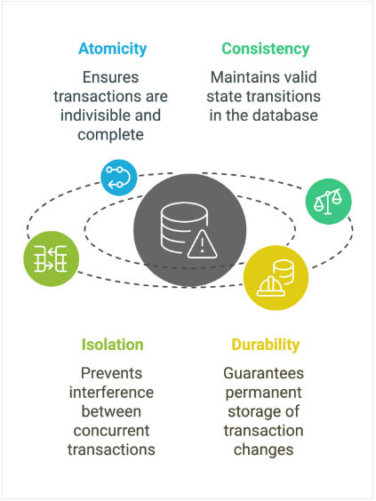

# Consistency 

## 12.06.25 - DB Consistency and ACID principles

- What is DB Consistency?
- What are ACID principles?
- ACID vs BASE principles
- Example application ACID principles

### What is DB Consistency?

- The state of data in which all copies or instances are the same across all systems and databases.
- Helps to ensure that the data is accurate, up-to-date and coherent across database systems, applications and platforms.
- It ensures that the users of data can trust the information they are accessing.
- Implementing data validation rules, data standardization techniques and data synchronization processes are a few ways we can ensure data consistency
- We employ ACID principles to ensure the data consistency

### ACID principles



1. **Atomicity**:

    - A transaction is treated as a single, indivisible unit.
    - All operations in a transaction must be completed fully or not at all. 
    - If any part of the transaction fails, the system should rollback the entire transaction

2. **Consistency**:

    - Ensures that a transaction brings the database from one valid state to another valid state while adhering to predefined rules and constraints.
    - After completing a transaction, the data must meet all the database integrity rules.

3. **Isolation**:

    - Prevents transactions from interfering with each other. 
    - When multiple transactions are executed simultaneously, isolation ensures they don't affect each other's outcomes.
    - Each transaction must be isolated to avoid conflicts - especially in high-concurrency environments.

4. **Durability**:

    - Guarantees that once a transaction is completed, its changes are permanently stored in the database. 
    - This ensures that data remains intact and accessible after failures.

#### ACID principles in a Relational Database

```sql
-- Transaction 1
INSERT INTO menu_a(food_a)
VALUES 
    ('Grapefruit'),
    ('Mango');

-- Transaction 2
INSERT INTO menu_b(food_b)
VALUES 
    ('Grapefruit'),
    ('Mango');
```

1. Beginning a transaction:

    ```sql
    BEGIN TRANSACTION;

    -- OR
    BEGIN WORK;

    -- OR
    BEGIN;
    ```

    **Example:**

    ```sql
    BEGIN TRANSACTION;

    INSERT INTO menu_a(food_a)
    VALUES 
        ('Grapefruit'),
        ('Mango');

    INSERT INTO menu_b(food_b)
    VALUES 
        ('Grapefruit'),
        ('Mango');
    ```

2. Committing a transaction:

    - Applies the changes to the database.

    ```sql
    COMMIT TRANSACTION;

    -- OR 
    COMMIT WORK;

    -- OR
    COMMIT;
    ```

    **Example:**

    ```sql
    BEGIN TRANSACTION;

    INSERT INTO menu_a(food_a)
    VALUES 
        ('Grapefruit'),
        ('Mango');

    INSERT INTO menu_b(food_b)
    VALUES 
        ('Grapefruit'),
        ('Mango');

    COMMIT;
    ```

3. Rolling back a transaction:

    - Undoes any changes that were made within the transaction

    ```sql
    ROLLBACK TRANSACTION;

    -- OR
    ROLLBACK WORK;

    -- OR 
    ROLLBACK;
    ```

    **Example:**

    ```sql
    BEGIN TRANSACTION;

    INSERT INTO menu_a(food_a)
    VALUES 
        ('Grapefruit'),
        ('Mango');

    INSERT INTO menu_b(food_b)
    VALUES 
        ('Grapefruit'),
        ('Mango');

    ROLLBACK;
    ```

**Sample  transaction script:**

```sql
BEGIN;

-- Step1: Debit 500 from account 1
UPDATE accounts 
SET balance = balance - 500
WHERE account_id = 1;

-- Step 2: Credit 500 to Account 3
UPDATE accounts 
SET balance = balance + 500
WHERE account_id = 3;

-- Step 3: Record transaction
INSERT INTO transactions (account_id, transaction_type, amount, description) VALUES (1, 'Transfer', 500.00, 'School fees');

-- Commit the transaction if both steps succeed
COMMIT;

-- Rollback if any error occurs
ROLLBACK;
```

### ACID vs BASE principles in NoSQL DB's

- BASE is an acronym for Basically Available, Soft state, Eventual consistency.
- Focuses on availability and flexibility over strict consistency.

- Basically available: The system guarantees availability, meaning it will respond to requests even if some parts of the system are down or unreachable.
- Soft state: Due to asynchronous updates, the system's state may change over time, even without input.
- Eventual consistency: Data will eventually become consistent, but there may be periods when it is temporarily inconsistent.


| Feature | **ACID** | **BASE** |
|---------|----------|----------|
| Full Form | Atomicity, Consistency, Isolation, Durability | Basically Available, Soft state, Eventually consistent |
| Core principle | Ensure reliable and consistent transactions | Prioritizes availability and performance over strict consistency |
| Data integrity | High - Guarantees data integrity at all times | Lower - Allows temporary inconsistencies |
Transaction handling | Transactions must complete fully or not at all | Best-effort transactions - may be incomplete or inconsistent temporarily |
| Scalability | Limited - works best with monolithic or traditional relational databases | High - Designed for distributed, scalable systems |
| Latency | Higher - Due to strict consistency requirements | Lower - Allows for faster response times |
| Use cases | Financial transactions, inventory management, order processing | Social media platforms, real-time analytics, content delivery network |


