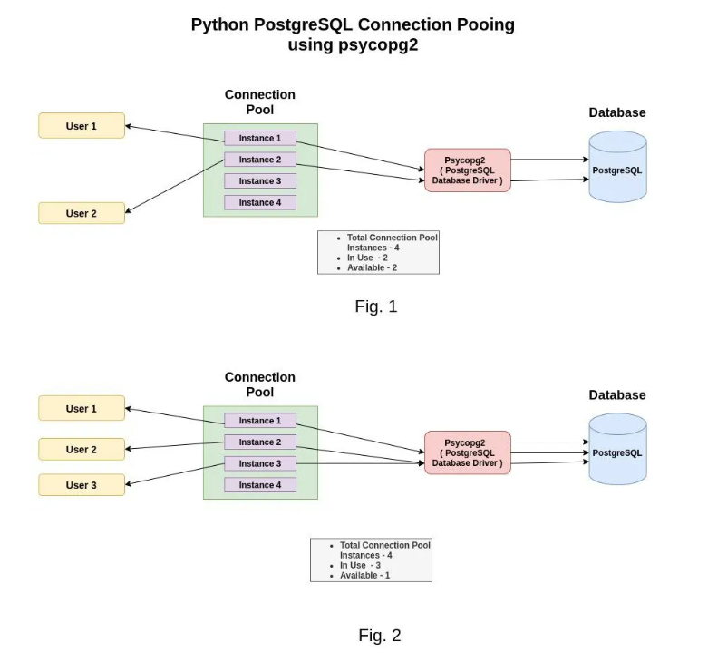
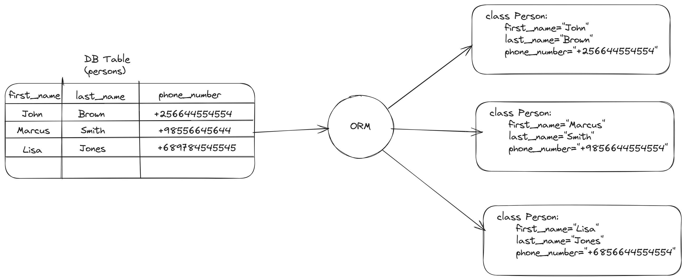

# Using PostgreSQL with Python

## Basics

- Installing `psycopg2` or `psycopg2-binary`
- Creating a DB connection using psycopg2
- Creating a cursor to execute SQL Commands
- CRUD using the cursor


### Installing `psycopg2` or `psycopg2-binary`

1. Create project directory:

    ```shell
    mkdir <directory-name>
    cd <directory-name>
    ```

2. Create and activate the virtual environment:

    ```shell
    python3 -m venv .venv --prompt=<project-name>

    source .venv/bin/activate
    ```

3. Install `psycopg2`

    - This will serve as our DB connector.
    - It will allow us to create a cursor that takes SQL commands to execute

        ```shell
        pip install psycopg2
        ```

    - In rare cases `psycopg2` might not work on your machine, it will the installation of the `psycopg2-binary`
    - It downloads the repo to your virtual environment. 
    - The functions used for the DB Connection do not change

        ```shell
        pip install psycopg2-binary
        ```

4. Create the requirements file:

    ```shell
    pip freeze > requirements.txt
    ```

### Creating a DB connection using `psycopg2`

1. Create a new database

    ```sql
    CREATE DATABASE suppliers;
    ```

2. Create Database user:

    ```sql
    CREATE ROLE <username> WITH LOGIN PASSWORD '<password>';
    ```

    - Grant the user privileges to the database

        ```sql
        GRANT <privilege-list> 
        ON DATABASE suppliers
        TO <username>;
        ```

3. Create `main.py` file and import psycopg2

    ```python
    import psycopg2
    ```

4. Create db connection function:

    ```python
    def connect():
        try:
            conn = psycopg2.connect(
                host="localhost",
                database="suppliers",
                user="supplier_admin",
                password="supply123",
                port=5432
            )
            return conn
        except (pyscopg2.DatabaseError, Exception) as error:
            print(error)
    ```

    - `database`: the name of the database that you want to connect
    - `user`: the username to authenticate the database connection
    - `password`: the password to authenticate
    - `host`: the database server address e.g `localhost`, an IP address or hostname/domain
    - `port`: the port number the database server is running on. Defaults to `5432`

### Creating a cursor to execute SQL Commands

- When using psycopg2 the cursor is what is used to execute the SQL commands
- The cursor is created using the connection object

1. Create the cursor:

    ```python
    cur = conn.cursor()
    ```

### CRUD operations using `psycopg2`

- In order to execute SQL commnads we use the `execute()` method that is provided by the cursor
- It takes the commands as strings.

**Syntax:**

```python
cur.execute("<sql-commands>")
```

#### Creating tables

```python
def create_tables():
    commands = (
        """ 
        CREATE TABLE vendors (
            vendor_id SERIAL PRIMARY KEY,
            vendor_name VARCHAR(255) NOT NULL
        );
        """,
        """
        CREATE TABLE parts (
            part_id SERIAL PRIMARY KEY,
            part_name VARCHAR(255) NOT NULL
        );
        """,
        """ 
        CREATE TABLE part_drawings (
            part_id INTEGER PRIMARY KEY,
            file_extension VARCHAR(5) NOT NULL,
            drawing_data BYTEA NOT NULL,
            FOREIGN KEY (part_id)
            REFERENCES parts (part_id)
            ON UPDATE CASCADE 
            ON DELETE CASCADE
        );
        """,
        """ 
        CREATE TABLE vendor_parts (
            vendor_id INTEGER NOT NULL,
            part_id INTEGER NOT NULL,
            PRIMARY KEY (vendor_id , part_id),
            FOREIGN KEY (vendor_id)
                REFERENCES vendors (vendor_id)
                ON UPDATE CASCADE ON DELETE CASCADE,
            FOREIGN KEY (part_id)
                REFERENCES parts (part_id)
                ON UPDATE CASCADE ON DELETE CASCADE
        );
        """
    )
    
    try: 
        # Establish connection
        conn = connect()
        
        with conn.cursor() as cur:
            # Execute sql commands
            for command in commands:
                cur.execute(command)
            # Commit the changes through connection
            conn.commit()
        conn.close()
    except (psycopg2.DatabaseError, Exception) as error:
        print(error)
```

#### Inserting data into tables

1. Insert 1 row at a time:

    ```python
    def insert_vendor(vendor_name):
        """ 
        Insert a new vendor into the vendors table
        """

        sql = """ INSERT INTO vendors(vendor_name)
            VALUES(%s) RETURNING vendor_id;
            """
            
        try:
            conn = connect()
            with conn.cursor() as cur:
                cur.execute(sql, (vendor_name,))
                
                # get the generated id back
                rows = cur.fetchone()
                if rows:
                    vendor_id = rows[0]
                
                conn.commit()
            conn.close()
        except (psycopg2.DatabaseError, Exception) as error:
            print(error)
    ```

2. Insert many rows at once

    ```python
    def insert_many_vendors(vendor_list: list):
        """ 
        Insert a list of vendors into the vendors table
        """
        
        sql = """ INSERT INTO vendors(vendor_name)
            VALUES(%s) RETURNING *;
            """
        try:
            conn = connect()
            with conn.cursor() as cur:
                cur.executemany(sql, vendor_list)
                conn.commit()
            conn.close()
        except (psycopg2.DatabaseError, Exception) as error:
            print(error)

    vendors = [('The Supply Co.',), ('Altech Solutions',), ('Fin Motor Parts',), ('Brown & Sons Engineering',)]
    insert_many_vendors(vendors)
    ```

#### Querying data from the database

- `psycopg2` provides 3 main methods to retrieve data from the database
- These methods vary in the number of records they return from the database
- In order to execute these methods you need to run a `SELECT` query using the `.execute()` of the cursor.

1. `fetchone()`

    - Returns one tuple at a time

    ```python
    cur.execute(<sql>)

    # Create a variable to hold the tuple that is returned
    row = cur.fetchone()
    ```

    ```python
    def get_vendors():
        """ Retrieve data from the vendors table
        """
        conn = connect()
        with conn.cursor() as cur:
            # Execute the SELECT statement
            cur.execute("SELECT * FROM vendors ORDER BY vendor_name;")        
            row = cur.fetchone()
            print(row)
    ```

2. `fetchmany()`

    - `fetchmany(size=cursor.arraysize)`: Default value is going to be the returned array size.
    - Fetches the next set of rows according to the `size` parameter
    - Returns a list of tuples

    ```python
    # Execute SELECT statement
    cur.execute(<sql>)

    # Create variable to hold list of results
    rows = cur.fetchmany(size=10)
    ```

    ```python
    def get_many_vendors(size=10):
        """ 
        Return a set of vendors limited by the size parameter.
        size: default=10
        """
        conn = connect()
        with conn.cursor() as cur:
            cur.execute("SELECT * FROM vendors ORDER BY vendor_name;")
            rows = cur.fetchmany(size=size)
            
            while rows:
                print(rows)
                # Retrieve the next set of results
                rows = rows = cur.fetchmany(size=size)
    ```

3. `fetchall()`

    - Retrieves all the records that match the query
    - Returns a list of tuples

    ```python
    # Run a SELECT query
    cur.execute(<sql>)

    # Store list of rows in a variable
    rows = cur.fetchall()
    ```

    ```python
    def get_all_parts():
        """ 
        Retrieves all parts from the database
        """
        conn = connect()
        with conn.cursor() as cur:
            cur.execute("SELECT * FROM parts;")
            rows = cur.fetchall()
            print(rows)
        conn.close()
    ```

## 28.05.25 - Mapping and ORM's 

- Connection Pooling
- Mapping query results to Python data types
- Intro to ORM(Object Relational Mapping)
- Examples of ORM's

### Connection Pooling



### Mapping query results to Python data types

| PostgreSQL Data Type | Python Data Type | Python Primitive Type |
|----------------------|------------------|-----------------------|
| `ARRAY` | `list` | |
| `BIGINT` | `int` | `int` |
| `BIT` | `bool` | `bool` |
| `BOOLEAN` | `bool` | `bool` |
| `BYTEA` | `bytes` | |
| `CHARACTER` | `str` | `str` |
| `CHARACTER VARYING` | `str` | `str` |
| `DATE` | `date`/`datetime` | |
| `DOUBLE PRECISION` | `float` | `float` |
| `INTEGER` | `int` | `int` |
| `INTERVAL` | `timedelta` | |
| `MONEY` | `float` | `float` |
| `NUMERIC` | `float` | `float` |
| `REAL` | `float` | `float` |
| `SERIAL` | `int` | `int` |
| `SMALLINT` | `int` | `int` |
| `TEXT` | `str` | `str` |
| `TIME` | `time`/`datetime` | |
| `TIMESTAMP` | `timestamp` | |

### Object Relational Mapping (ORM)

- a code library that automates the transfer of data stored in relational database tables into objects that are more commonly used in application code.



- ORM's provide a high-level abstraction upon a relational database that allows a developer to write Python code instead SQL to interact with the database.
- You can achieve the same CRUD operations you would with SQL
- ORM's do not provide the ability to create databases or database users

- For example you have table in the database called `employees`. You want to retrieve all employees that work in the "Finance" `department`.

```sql
SELECT * FROM employees WHERE department = 'Finance';
```

```python
employees = Employees.objects.filter(department="Finance")
```

**Examples:**

1. SQLAlchemy*
2. Django ORM*
3. Peewee
4. PonyORM
5. SQLObject


