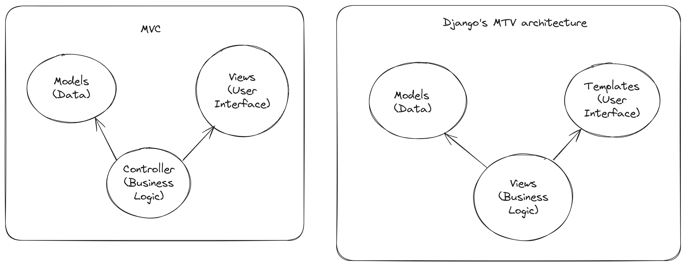
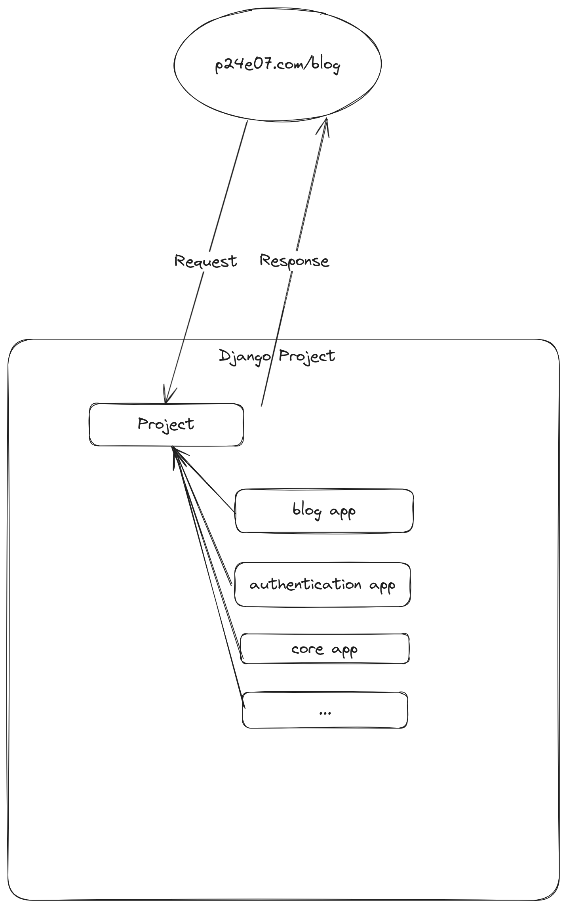
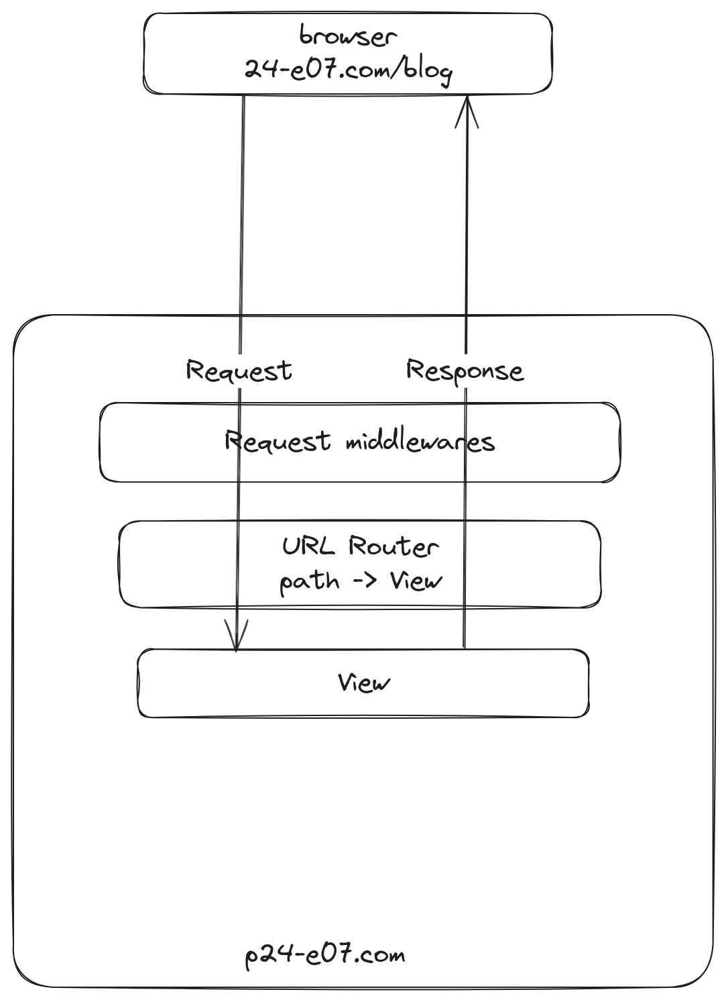

# Frameworks - Django

## 24.06.25 - Intro to Django

- What is a Framework?
- What is Django?
- MVC(Model-View-Controller) vs MTV(Model-Template-View) architectures
- Installing Django
- Boilerplate files

### What is a framework?

- Is like a foundation for building software.
- It provides the structure and tools to develop your projects
- Frameworks have a set way of doing things, which can make development faster and more organised

### What is Django?

[Django Docs](https://docs.djangoproject.com/en/5.2/)

- A Python Web Development Framework
- It take care of all the complex and allows you to concentrate on building your application
- It emphasizes the use of the DRY principle as it comes out-of-box with features like authentication, database connection and CRUD operations.
- Django utilizes its own version of the MVC pattern/architecture





### Installing Django

1. Create a project directory:

    ```shell
    mkdir <project-name>

    cd <project-name>
    ```

2. Create and activate the virtual environment:

    ```shell
    # Create virtual environment
    python3 -m venv .venv --prompt=<project-name>

    # Activate
    source .venv/bin/activate
    ```

3. Install Django:

    ```shell
    pip install Django

    # Check installation 
    django-admin help
    ```

4. Create a django project:

    ```shell
    django-admin startproject <name-of-project> .
    ```

5. Test django project creation(Running the development server):

    ```shell
    python manage.py runserver
    ```

6. Create a django app:

    ```shell
    django-admin startapp core
    ```

7. Add the app to the `INSTALLED_APPS` setting in `settings.py:

    ```python
    INSTALLED_APPS = [
        # existing apps...
        "core" #core.apps.CoreConfig
    ]
    ```

## 25.06.25 - Files & utilities, URL mapping/routing, Request/Response cycle

- Boilerplate files break down
- The request/response cycle
- Migrations
- URL Conf system in Django


### Files and utilities

**Project Directory:**

1. `asgi.py`:

    - Asynchronous Server Gateway Interface
    - An entry point to serve the Django Application asynchronously
    - Asynchronous application settings

2. `settings.py`:
com
    - Contains all configurations for the Django project
    - Includes: database settings, installed apps, static file, template file paths, etc

3. `urls.py`:

    - Defines the URL patterns
    - Maps URL's to specific views or functions that handle requests

4. `wsgi.py`:

    - Web Server Gateway Interface
    - Entry point when serving the Django application synchronously

**App Directory:**

1. `admin.py`:

    - Registers models with the Django Admin interface
    - Allows for easy management of database content

2. `apps.py`:

    - Application configuration file
    - Contains the app name and other settings

3. `models.py`:

    - Define the data models that will used to structure and manipulate the database tables

4. `tests.py`:

    - Stores the tests for our django apps

5. `views.py`:

    - Contains the logic for handling requests and returning responses
    - Often interacts with models and renders templates

6. `migrations/`:

    - Contains the database migrations - track the changes to your models and allow for database schema evolution

**`manage.py` utility:**

- A command-line utility that lets you interact with Django in various
- In some cases can be interchanged with `django-admin`
- We use it by calling:

    ```shell
    python manage.py <django-command>

    # Get help
    python manage.py <command> --help
    ```

### Request/Response Cycle



### URL Configurations

- The process of mapping URL's to views in a Django app
- It is recommended that you have a separate `urls.py` file for each application in your Django project. Include those `urls.py` in the main URL configuration file

1. Initialize the `urls.py` file for each app:

    1. Create the file:

        ```shell
        touch <app-directory>/urls.py
        ```

    2. Add the following boilerplate code:

        ```python
        from django.urls import path

        app_name = "core"

        urlpatterns = [
            
        ]
        ```

2. Include the app urls in the main url configuration:

    ```python
    from django.urls import path, include

    urlpatterns = [
        # existing patterns
        path("", include("core.urls", namespace="core")),
        path("blog/", include("blog.urls", namespace="blog")),
    ]
    ```

    - Make sure the `namespace` value matches the `app_name` value from the corresponding `urls.py` file
    - The path should always be defined with a trailing forward-slash(`/`)

3. Create views for app:

    ```python
    # views.py 
    from django.http import HttpResponse

    def home(request):
        return HttpResponse("Welcome to the Homepage")
    ```

    - A function-based view should have the `request` object as the first parameter

4. Create a path that points to that view:

    ```python
    # urls.py
    from . import views

    urlpatterns = [
        # ... 
        path("", views.home, name="home"),
    ]
    ```

    - The name of the path should always be unique to that app

### Migrations

- Migrations are the way Django handles changes to your database schema
- Adding a field, deleting a field, changing constraints, deleting a model, etc
- In order to create migration files you should run `python manage.py makemigrations` everytime you make changes to your `models.py` file
- In order to apply migrations run `python manage.py migrate`