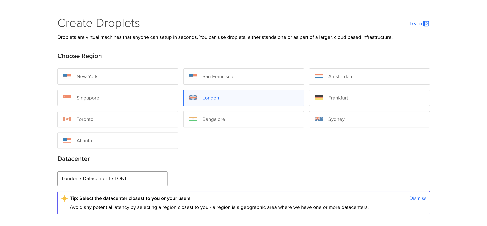
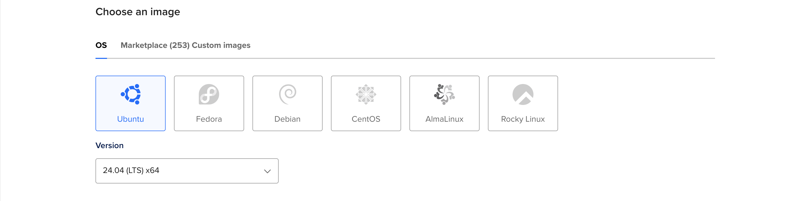
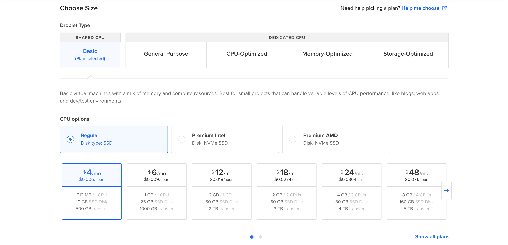
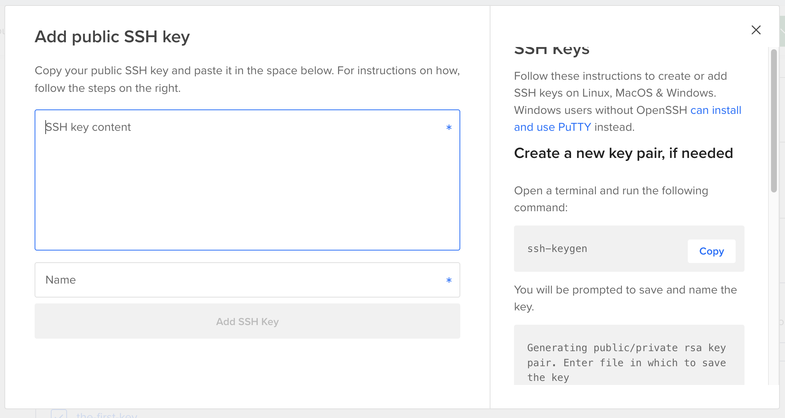
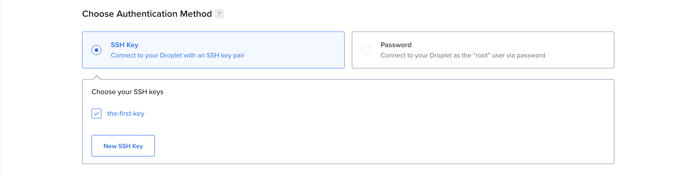
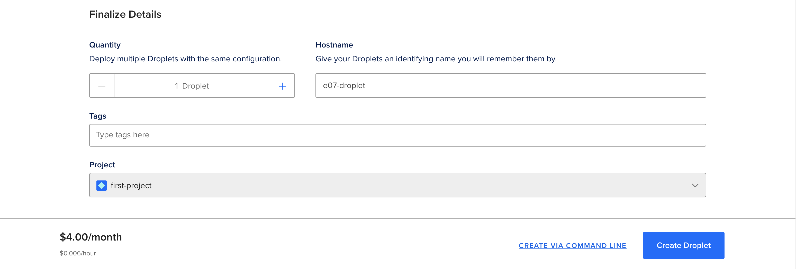

# Setting up Django with Postgres, Nginx and Gunicorn on Ubuntu

- We will configure and install some components on an Ubuntu platform to support and serve our Django application 
- We will setup a PostgreSQL database instead of using SQLite 
- The Gunicorn application server with be configured to interface with out application
- The Nginx Web Server will be configured to reverse proxy to Gunicorn

## Setup an Ubuntu VM (virtual machine) - Droplet

1. From the console of your project navigate to the `Droplets` page
2. From the `Droplets` page click on `Create Droplet`
3. Pick a region and select a datacenter if the option is available
        
    - As a general rule of thumb you want to deploy to a region that is closer to your targeted users.
4. Under `OS` select Ubuntu and pick your preferred version from the dropwdown
        
    - The latest with `LTS` (Long Term Support) is usually the best one to use as it is more stable.
5. Under the `Choose Size` section:
   1. Pick the `Basic` Droplet Type
   2. Under `CPU Options` select `Regular`
   3. Select the lowest plan possible
        
6. Under `Choose An Authentication Method` select `SSH Key` then click the `Add SSH Key` button
    
    - Create a new SSH Key:
        **Using `ssh-keygen`:**
        1. In your terminal use the following command:
            ```shell
            ssh-keygen -t rsa
            ```
            - `-t` allows you to specify the type of key
        2. You will be prompted to save and name the key.

            ```shell
            Generating public/private rsa key pair. Enter file in which to save the key (/Users/USER/.ssh/id_rsa):
            ```
        3. Next you will be asked to create and confirm a passphrase for the key (highly recommended):
            ```shell
            Enter passphrase (empty for no passphrase):
            Enter same passphrase again:
            ```
        4. Copy and paste the contents of the `.pub` file, typically `id_rsa.pub`, into the SSH key content field
            ```shell
            cat ~/.ssh/id_rsa.pub
            ```

        **Using PuTTYgen:**
        1. In PuTTYgen, under Parameters, choose:
            - Type of key to generate: Usually `RSA` (2048 or 4096 bits).

        2. Click `Generate`.

        3. Move your mouse randomly in the blank area to create entropy.

        4. Once complete, PuTTYgen will display your public key.

        5. (Optional) Enter a Key passphrase to protect the private key.

        6. Click Save private key → save as `.ppk` file (e.g., `mykey.ppk`).

        7. Copy the public key text 
   
    - Give your key an appropriate name and click `Add  SSH Key` to confirm
    
7. Under `Finalize Details` give your droplet an easily identifiable hostname and select the project you want to create in under
   
8. Confirm that all configurations are correct and click on `Create Droplet`

**Connect to Droplet via SSH:**

To do so, you need to have an SSH client, like OpenSSH or PuTTY, and the following three pieces of information:

1. The Droplet’s IP address.
    - After your Droplet is created, its IP address displayed in the DigitalOcean Control Panel.

2. The username on the server that you want to connect as.
    - The default username on initial creation is root on most operating systems, like Ubuntu and CentOS. If you add another user, you can use that username instead.

3. The authentication method for that user.
    - If you add SSH keys to your Droplet, you can connect using those keys, which we strongly recommend for its additional security. Otherwise, if you use password authentication, use the password you chose.

- Once you have your Droplet’s IP address, username, and password or SSH keys, follow the instructions for your SSH client. OpenSSH is included on Linux, macOS, and Windows Subsystem for Linux. Windows users with Bash also have access to OpenSSH. Windows users without Bash can use PuTTY.

**Connect using the terminal:**

1. Connect to Your Server

    - Use the ssh command:
        ```shell
        ssh username@server_ip
        ```

    - Example:
        ```shell
        ssh ubuntu@203.0.113.10
        ```

2. (Optional) Specify a Private Key

    - If your server uses a key pair (common for cloud servers):
        ```shell
        ssh -i /path/to/private_key.pem username@server_ip
        ```

    - Example:
        ```shell
        ssh -i ~/.ssh/id_rsa ubuntu@203.0.113.10
        ```

        💡 **Tip: Make sure your key has the right permissions:**
        ```shell
        chmod 600 ~/.ssh/id_rsa
        ```

3. Accept the Host Key

- The first time you connect, you’ll see:
    ```shell
    The authenticity of host '203.0.113.10' can't be established.
    Are you sure you want to continue connecting (yes/no)?
    ```

Type *yes* and press `Enter`.

4. Enter Your Password (If Required)

- Type your password (nothing will show as you type — this is normal).

- Press `Enter`.


**Connect using PuTTY:**

1. Open PuTTY & Configure Session

    1. Open PuTTY (you’ll see the PuTTY Configuration window).

    2. Under Session:

        - In Host Name (or IP address) → enter your server’s IP.

        - Ensure Port = 22 (unless specified otherwise).

        - Set Connection type = SSH.

    3. (Optional) Under Saved Sessions → type a name and click Save
    This saves the settings for future use.

2. Load a Private Key

- If you’re using a private key:

    1. In the left sidebar, go to Connection → SSH → Auth.

    2. Click Browse and select your .ppk file (PuTTY private key).

        - If you have an OpenSSH key, use PuTTYgen (installed with PuTTY) to convert it to .ppk.

3. Connect to the Server

    1. Click Open.

    2. A terminal window appears. The first time, PuTTY will ask to trust the server’s host key — click Yes.

    3. Enter your username and press Enter.

    4. Enter your password (you won’t see it while typing) and press Enter.


## Install the Packages from the Ubuntu Repositories

- We will download and install all of the necessary packages from the Ubuntu repositories
- We will need to install Python, PostgreSQL, cURL and a few other components

```shell
sudo apt update
sudo apt install python3-venv python3-dev libpq-dev postgresql postgresql-contrib nginx curl
```

## Creating the PostgreSQL Database and User

1. Login to `psql`:
    ```shell
    sudo -u postgres psql
    ```

2. Create the Database for the project:
    ```sql
    CREATE DATABASE <database-name>;
    ```

3. Create the database user for our project:
    ```sql
    CREATE USER <username> WITH PASSWORD '<password>';
    ```

4. Modify connection parameters for the database user:
    - Set the default character encoding to `utf-8` which Django expects
    - Set a default transaction isolation scheme to `read committed`, which blocks reads from uncommitted transactions.
    - Set the default timezone to `UTC` which is normally the default on Django projects.

    ```sql
    ALTER ROLE <username> SET client_encoding TO 'utf-8';
    ALTER ROLE <username> SET default_transaction_isolation TO 'read committed';
    ALTER ROLE <username> SET timezone TO 'UTC';
    ```

    - These are recommendations made by the Django project itself

5. Give the new user access to administer the database:
    ```sql
    GRANT ALL PRIVILEGES ON DATABASE <database-name> TO <username>;
    GRANT ALL PRIVILEGES ON SCHEMA public TO <username>;
    ```

## Create a Python Virtual Environment for Project

1. Create a project directory:
    ```shell
    mkdir first_project
    cd first_project
    ```

2. Create and activate python virtual environment:
    ```shell
    python3 -m venv .venv --prompt=first-venv

    source .venv/bin/activate
    ```

4. Install required packages:
    - `django`: The Web Framework we want to utilize
    - `gunicorn`: The application that will connect to Nginx
    - `psycopg2`: Database connector for PostgreSQL
    - `python-dotenv`: To abstract environment variables
    ```shell
    pip install django gunicorn psycopg2-binary python-dotenv
    ```

## Create and Configure New Django Project

1. Create the django project directory:
    ```shell
    django-admin startproject config .
    ```
    

**Configure environment variables:**

1. Open the `settings.py` and copy the Django Secret Key:
    ```shell
    nano config/settings.py
    ```

2. Create the `.env` and add the variables to it:

    ```shell
    nano .env
    ```

    ```
    SECRET_KEY=<your-django-secret-key>

    # Database Settings
    DB_NAME=<your-database-name>
    DB_USER=<your-dtabase-username>
    DB_PASSWORD=<your-database-password>
    DB_HOST=<your-database-host>
    DB_PORT=<your-database-port>
    ```

    - In order to save the chnages and exit from nano: `Ctrl + X` -> `Shift + Y` -> `Enter`

**Configuring the settings.py for deployment:**

1. Open the `settings.py` file:
    ```shell
    nano config/settings.py
    ```

2. Add the import for the `os` module:
    ```python 
    import os
    ```

3. Add the import for the `load_dotenv` function and call it:
    ```python
    from dotenv import load_dotenv

    load_dotenv()
    ```

4. Set the `DEBUG` setting to `False`:

    ```python
    DEBUG = False
    ```

5. Edit the `SECRET_KEY` setting to use environment variables:
    ```python
    SECRET_KEY = os.getenv("SECRET_KEY")
    ```

6. Add the IP addresses and domains for the `ALLOWED_HOSTS`:
    - Because the database will be connected from the `localhost` we need to the `localhost` or `127.0.0.1` to the the setting
    - Add the Public IP Address for your virtual machine
    - (Optional) add any domains configured for the project
    ```python
    ALLOWED_HOSTS = ["localhost", "<your-droplet-public-ip>"]
    ```

7. Add the Database settings to connect to PostgreSQL:

    ```python
    DATABASES = {
        'default': {
            'ENGINE': 'django.db.backends.postgresql_psycopg2',
            'NAME': os.getenv("DB_NAME"),
            'USER': os.getenv("DB_USER"),
            'PASSWORD': os.getenv("DB_PASSWORD"),
            'HOST': os.getenv("DB_HOST"),
            'PORT': os.getenv("DB_PORT")
            
        }
    }
    ```

8. Add the `STATIC_ROOT` path:

    ```python
    STATIC_ROOT = os.path.join(BASE_DIR, 'staticfiles/')
    ```

- In order to save the chnages and exit from nano: `Ctrl + X` -> `Shift + Y` -> `Enter`

## Complete Django Project Setup

1. Generate the migration files and apply migrations to our database:
    ```shell
    python manage.py makemigrations
    python manage.py migrate
    ```

2. Create a superuser:
    ```shell
    python manage.py createsuperuser
    ```

3. Collect all static content into the configured directory:
    ```shell
    python manage.py collectstatic
    ```

4. Allow access to port `8000`:
   - UFW firewall will be protecting the server and it normally blocks access to ports that have not publicly exposed.
   - We will use the port `8000` to initally test our deployment
    ```shell
    sudo ufw allow 8000
    ```

5. Test the Django Development server:
    ```shell
    python manage.py runserver 0.0.0.0:8000
    ```

    - The `0.0.0.0` IP Address exposes the network/server to the Public internet allowing you to access the server via it's public IP address.

6. In your browser navigate to:
    ```
    http://<your-droplet-public-ip>:8000
    ```

## Test Gunicorn’s Ability to Serve the Project
## Creating Gunicorn systemd Socket and Service Files
## Check Gunicorn Socket File
## Testing Socket Activation
## Configure Nginx to Proxy Pass to Gunicorn
## Troubleshooting Nginx and Gunicorn
