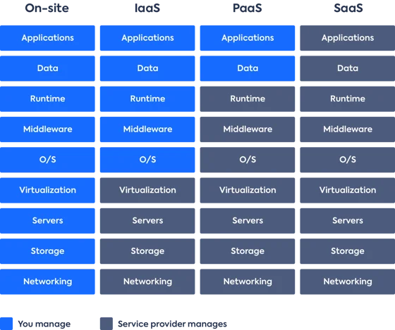

# Cloud Computing

## 1. Introduction to Cloud Computing

**What is cloud computing, and how does it differ from traditional on-premises infrastructure?**

- Cloud computing is delievry of computing resources - including storage, processing power, databases, networking, analytics, AI, and software applications - over the internet(the cloud).
- By outsourcing such resources companies can utilize such assets as and when needed without the need to purchase or maintain a physical, on-premises IT infrastructure.

**What are the key benefits and drawbacks of using cloud services?**

- _On-demand self service:_ Cloud computing provides easy acces for users to requistion new resources or scale existing when needed. Teams can automate their provisioning in a simple way using Infrastructure as code(IaaC) tools, e.g Terraform and Ansible.
- _Broad Network Access:_ Physical hardware location is a significant concern when delivering the optimal user experience. Cloud computing combats this limitation by offering globally-distributed physical hardware, allowing organisations to strategically provision location-targeted instances.
- _Resource Pooling:_ Computing resources are dynamically divided and allocated on demand. since a cloud host's physical machines are dynamiclly provisioned and shared between multiple tenants, cloud hardware is thoroughly optimized for maximum usage.
- _Rapid Elasticity:_ Cloud setups can grow and shrink dynamically, allowing users to request that their computational resources auto-scale with different traffic demands. 
- _Measured Service:_ Cloud service providers give detailed usage metrics that are used to communicate usage costs. They generally utilize a pay-as-you-go model, only charging customers for the exact amount of resources utilized.

**What are the different types of cloud deployment models (public, private, hybrid) and when would you use each?**

1. _Public:_ Delivers computing resources, over the internet from a cloud service provider, such as AWS, Microsoft Azure, Google Cloud Platform, etc. The providers own and operate all hardware, software and other supporting infrastructure.
2. _Private:_ Computing resources are dedicated exclusively to an organizatin. Can either be physically located an organizations on-site data center or hosted by a cloud provider. 
3. _Hybrid:_ These are a combination of public and private clouds, connected together with technology that enables data and application to work together. Sensitive services and applications can be kept in the secure private cloud while publicly-accesible web servers and customer-facing endpoints can live in the public cloud. 

## 2. Cloud Service Models

**What are the three main cloud service models (IaaS, PaaS, SaaS), and what are their differences?**

1. _Infrastructure as a Service(IaaS):_ 
   
   - This is the foundational layer of cloud services that allows organisations to rent It infrastructure - servers, storage, networks, etc. 
   - This lets users reserve and provision the resources they need out of raw physical server warehouses. 
   - It also allows users to reserve machines pre-configured for specific tasks like load balancers, email servers, distributed queues.

2. _Platform as a Service(PaaS):_ 

    - this is built on top of IaaS and provides resources to build user user-level tools and applications. 
    - Provides the underlying infrastructure, like compute, network, and storage as well as development tools, DBMS's and middleware.
    - It leverages IaaS to automatically allocate the resources needed to power a language-based tech stack, eg, Ruby on Rails, Java Spring MVC, MEAN, JAM, etc. This allows PaaS users to easily upload their application code and get up and running fast.

3. _Software as a Service(SaaS):_ 

    - Delivers software applications over the internet, on-demand and typically by subscription.
    - The providers host and manage the application, addressing software upgrades and security patching as needed.

**Can you provide real-world examples of IaaS, PaaS, and SaaS?**

1. _IaaS:_
    - Data centers
    - AWS EC2
    - Digital Ocean Droplets

2. _PaaS:_
    - AWS Lambda
    - Heroku
    - PythonAnywhere

3. _SaaS:_
    - Dropbox
    - Slack
    - MailChimp

## 3. Cloud Providers and Ecosystem

**Who are the major cloud service providers (AWS, Azure, GCP, etc.), and what are their unique offerings?**

**How do pricing models generally work in cloud platforms (pay-as-you-go, reserved instances, free tiers)?**

**What are some popular open-source or self-hosted cloud solutions (e.g., OpenStack)?**

